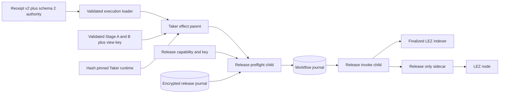
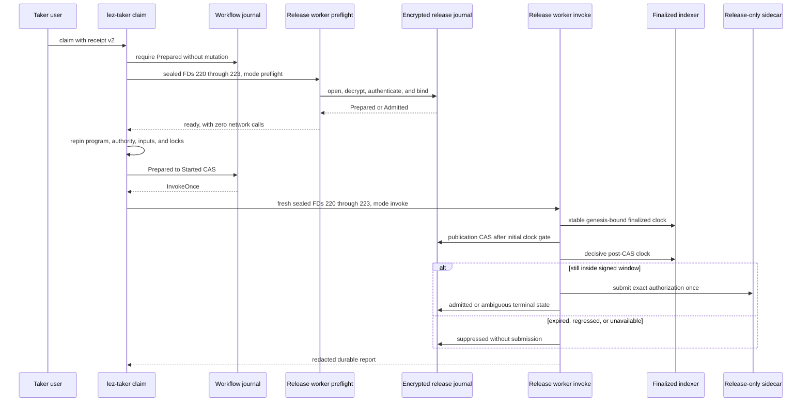

# ADR 0157: Preflight and compose the Tag14 release

- Status: Accepted as an M7 semantic-composition checkpoint
- Date: 2026-08-04

## Context

ADR 0155 gave the existing finalized-gated release service a sealed process
ABI, and ADR 0156 made that ABI selectable only through an explicit schema-v2
Taker authority. The actor still used the schema-v1 marker route. Calling the
release service only after consuming the workflow CAS would also turn a
missing, corrupt, wrongly keyed, or mismatched journal into an avoidable
unknown outcome.

## Decision

The sealed invocation is versioned again: schema 1 remains invoke-only for
compatibility, while schema 2 carries an explicit `preflight` or `invoke`
mode. Preflight validates all sealed descriptors, config, capability, key,
directory, authenticated journal bytes, and exact run/runtime/terms/client
binding. It makes no finalized-indexer request, sidecar request, publication
CAS, or workflow transition. Only `Prepared` and already-`Admitted` journal
states are ready.

For a schema-v2 Tag14 route, the actor reparses retained Stage A/B and the
private view key inside the parent, rederives the exact public v3 terms, and
binds them to the hash-pinned Taker runtime. It then gives the child only:

- FD 220: canonical schema-v2 invocation;
- FD 221: sealed release-only sidecar capability;
- FD 222: sealed journal protection key; and
- FD 223: already-open owner-private state directory.

The general LEZ capability, all Monero RPC credentials, private role manifest,
view key, spend share, and generic FDs 200 through 218 are absent. The literal
`lez-taker claim` path runs preflight while workflow state is `Prepared`, then
repins everything and consumes the workflow CAS immediately before one invoke
attempt. Restart states skip preflight and never rearm.

## Components

## Publication flow

## Atomicity argument

The workflow and release journals are not a distributed transaction. They are
two nested, monotonic one-attempt authorities. Preflight prevents locally
provable journal/config failures from consuming the outer workflow CAS. After
that CAS, the inner release journal still grants at most one publication. A
post-CAS clock regression, expiry, or outage suppresses without a node call;
an uncertain node result becomes permanently ambiguous and cannot be retried.

Cross-chain conditional atomicity remains grounded in the release journal:
the preparer creates it only from finalized LEZ Fund, the exact confirmed
Monero output, authenticated wallet topology, the completed Taker claim
presignature, and the signed half-open release window. Therefore a Tag14 send
cannot be armed from Stage A/B alone. This checkpoint does not prove future
reorg immunity, finalized Tag14 observation, or the later Monero sweep.

## Verification and resources

The real worker process proof is GREEN 1 of 1: preflight leaves the journal
`Prepared`, makes zero indexer/sidecar calls, invocation admits once, and a
fresh process observes only. The actor effect-route suite is GREEN 8 of 8 and
proves FDs 220 through 223 are the only auxiliary Tag14 descriptors. The
literal Maker/daemon/Taker process proof is GREEN 1 of 1 in 164.85 seconds and
covers rejected-preflight retry, invoke once, observe/reconcile, process-free
Complete, and losing-branch exclusion. Release-authority tests are GREEN 39
including the public test, with strict Clippy and warning-fatal Rustdoc GREEN.

These component/process tests use temporary owner-private files, SQLite,
sealed memfds, deterministic cryptographic fixtures, and in-process loopback
RPC doubles. They use no Docker daemon, external node, public RPC, DNS, faucet,
peer, or public funds. The real worker and literal CLI boundaries are verified
separately; a single actual-node CLI replay and semantic finalized observer
remain required before claiming the whole claim corridor as production-ready.
