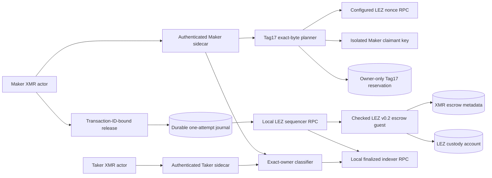
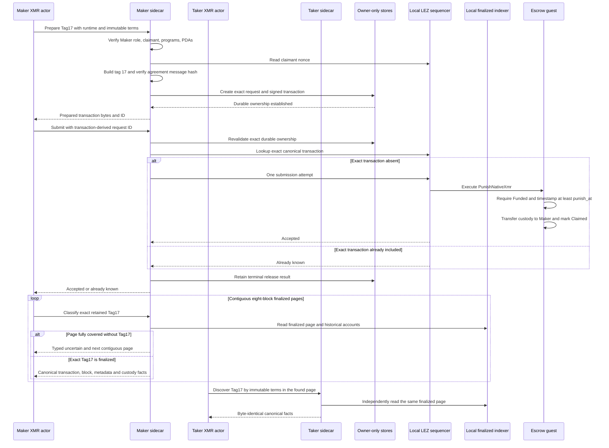

# ADR 0158: Prepare and release Tag17 once

- Status: Accepted as an M7 XMR-recovery component checkpoint
- Date: 2026-08-04

## Context

The checked LEZ v0.2 guest, pinned IDL, protocol, and client already exposed
`PunishNativeXmr` as instruction tag 17. The authenticated sidecar deliberately
returned `Unavailable`, however, so an actual Maker actor could not build or
release the recovery transaction. Calling the generated client's convenience
method would be unsafe here because that helper builds and submits in one call,
bypassing the repository's durable preparation and one-attempt release boundary.

Tag 17 transfers the funded LEZ custody balance to the Maker claimant at or
after `punish_at`. It is the recovery branch when the Taker does not complete
the earlier signed Tag-16 refund. Preparation must not itself create a chain
effect, and a crash or retry must not regenerate bytes against a new nonce.

## Decision

The Maker sidecar now builds the exact generated tag-17 message locally,
signs it only with its isolated claimant key, validates the ordered metadata,
custody, and claimant accounts, and requires its NSSA message hash to equal the
immutable agreement's `punish_message_hash`. It persists the complete request
and signed transaction in the existing owner-only create-once reservation store
before returning bytes.

Submission remains a separate authenticated generic transaction call. It is
admitted only when the request ID is derived from the exact transaction ID and
the in-memory preparation is byte-identical to the owner-only durable
reservation. The existing durable server journal performs one canonical node
lookup followed by at most one send and replays the retained result after a
process restart. The sidecar does not use host time to authorize punishment:
the checked guest remains authoritative for both funded state and the inclusive
`punish_at` boundary.

## Components

## Preparation and release flow

The page size is scan pagination, not confirmation depth. A page advances only
after its end height is Bedrock-finalized and re-read consistently; pages are
contiguous from the finalized Tag13 funding height. Therefore reducing a page
from 64 to eight blocks cannot weaken finality or skip a candidate, and it
reduces local post-inclusion wait to at most the remainder of one page.

## Atomicity argument

This is not a distributed transaction across LEZ and Monero. The recovery
property is conditional on the precommitted Stage-A and Stage-B cryptographic
construction and each chain's finality assumptions.

Before either asset is locked, the agreement commits distinct claim, refund,
and punishment messages and disjoint time windows. Before `punish_at`, the
Taker can use the signed Tag-16 branch to recover LEZ; its completed aggregate
signature reveals the Taker adaptor share needed by the Maker to reconstruct
and sweep the Monero recovery output. At and after `punish_at`, the guest
rejects Tag 16 and permits only the Maker-signed Tag 17 while custody remains
`Funded`. A successful Tag 15, Tag 16, or Tag 17 empties the same custody and
moves metadata to one terminal state, so later competing branches fail on
chain. Consequently the Taker cannot both retain the Monero output and recover
the LEZ after abandoning Tag 16, while the Maker has a unilateral LEZ recovery
after the exclusive boundary.

Process atomicity is narrower. Preparation has no submission authority and
becomes visible only after exact bytes are durable. Release accepts no arbitrary
request identity, performs at most one node send for the retained request, and
never rearms after an ambiguous or terminal outcome. Restart restores the same
bytes without reading a new nonce. Chain rejection near the boundary is not
treated as permission to regenerate or retry blindly.

## Verification and remaining proof

Focused process tests prove canonical construction, isolated claimant signing,
agreement-message binding, wrong release-ID rejection with zero node calls,
one lookup plus one send, byte-identical replay, and restart restoration without
nonce-source access. They use deterministic keys, owner-private temporary
directories, and an in-process literal-loopback sequencer double. No Docker,
public RPC, faucet, public funds, DNS, or external service is used.

Pushed rehearsal `m7tag17124df10a` executed the current checked guest and
obtained one accepted Tag17 release after the boundary, with no public RPC,
faucet, public funds or external finality service. It did not certify F5:
canonical evidence failed because this observer still rejected `Punish` and
the runner waited for an unnecessary fixed 64-block range. Exact cleanup passed
and independent Docker queries found no run-labelled resource.

RED/GREEN now makes the observer accept only the canonical
`PunishNativeXmr` instruction, metadata/custody/claimant account order,
claimant signature, agreement message hash, timestamp at or after
`punish_at`, terminal `Claimed` metadata and zero custody. Maker exact-owner
and Taker discovery tests agree on the same facts, while the protocol model
independently rejects pre-boundary facts. A fresh pushed actual-node replay is
still required before F5 changes to GREEN. F3 and F6 additionally remain open
for a joined two-devnet recovery corridor, losing-branch rejection, exact
cleanup, and adverse concurrency cases.
