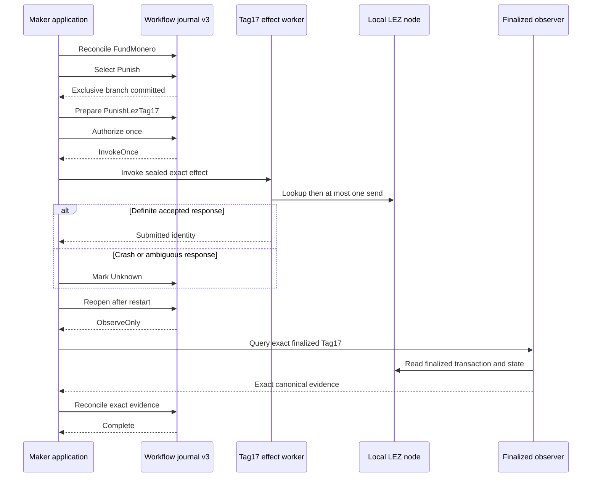

# ADR 0159: Model Tag17 as a durable application branch

- Status: Accepted as an M7 application-composition prerequisite
- Date: 2026-08-04

## Context

ADR 0158 proves that the checked guest and authenticated Maker sidecar can
prepare, release, and independently classify the exact Tag17 punishment on
actual local nodes. The application workflow journal still modeled only Claim
and Refund, however. An application could therefore not select punishment as
an exclusive terminal branch, consume one invocation authority, or recover an
ambiguous Tag17 attempt after restart.

This journal is a process authority, not chain truth. It may authorize one
effect attempt and remember exact reconciliation, but it must not infer that an
effect succeeded. A finalized LEZ observation remains the only admissible
success source for Tag17.

## Decision

Add `Punish` as a third exclusive workflow branch and
`PunishLezTag17` as a Maker-only step whose predecessor is the reconciled
Maker `FundMonero` step. The new value is stored only in workflow schema v3.
Branch selection remains a durable compare-and-set: Claim, Refund, and Punish
cannot replace one another. The step consumes its invocation authority once;
after a crash, Started or Unknown can only be observed, never invoked again.
Only exact LEZ-finalized reconciliation can advance the step to Complete.

New journals are schema v3. Exact schema-v2 Claim/Refund journals remain
readable without migration and keep `user_version = 2`; they cannot store the
new branch. Future or structurally modified schemas still fail closed. This
avoids silently changing durable authority beneath an in-flight swap.

## Components

```mermaid
flowchart LR
    MakerApp["Maker application"] --> Workflow["Owner-private workflow journal v3"]
    Workflow --> BranchCAS["Exclusive Claim Refund Punish CAS"]
    BranchCAS --> Tag17Step["Maker-only PunishLezTag17"]
    Tag17Step --> EffectRouter["Role-fixed effect router"]
    EffectRouter --> Tag17Worker["Sealed Tag17 worker"]
    Tag17Worker --> MakerSidecar["Authenticated Maker sidecar"]
    MakerSidecar --> LezNode["Local LEZ sequencer RPC"]
    LezNode --> Guest["Checked escrow guest"]
    Guest --> Indexer["Local finalized indexer RPC"]
    Indexer --> Observer["Exact finalized observer"]
    Observer --> Workflow
    Legacy["Exact workflow journal v2"] --> Compat["Read without migration"]
    Compat --> Workflow
```

The effect-router and worker nodes show the next composition boundary. This
decision implements the durable branch and authority layer only; it does not
claim that the application already invokes those nodes.

## Restart and reconciliation flow

## Atomicity argument

The journal preserves process atomicity by committing one terminal branch
before its branch-specific effect, admitting only the role assigned to that
step, and changing Prepared to Started in one SQLite transaction before any
external invocation. No restart, losing branch, or repeated caller can regain
submission authority. Completion requires exact external evidence and cannot
be manufactured from a worker exit status.

Cross-chain atomicity remains conditional and narrower. The checked guest makes
Tag15, Tag16, and Tag17 mutually exclusive over one funded LEZ custody object,
and Stage A/B bind the Monero and LEZ recovery material. This journal prevents
the application from locally choosing conflicting branches, but it does not by
itself prove the joined Monero abandonment economics, reorg behavior, or the
literal both-refund language in F6. GW-M4-003 remains the explicit production
disposition item for that protocol-level mismatch.

## Verification and next boundary

Focused tests prove wrong-role rejection, predecessor enforcement, exclusive
branch selection, one invocation, restart ObserveOnly, Unknown-to-Complete
finalized reconciliation, exact replay, and unmodified schema-v2 compatibility.
They use only owner-private temporary SQLite files; no Docker, RPC, faucet,
network, public funds, or external resource is involved.

The next RED/GREEN slice connects this step to a schema-versioned Maker effect
authority and sealed Tag17 worker, followed by an application-owned local
abandonment corridor. F3 and F6 remain open until the joined LEZ/Monero outcome
and adverse restart/concurrency cases are executed.
