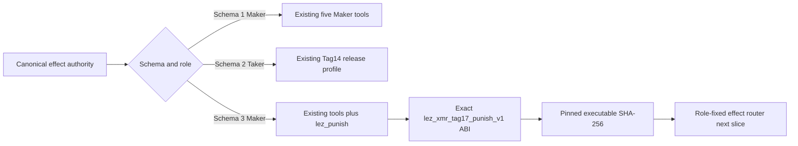
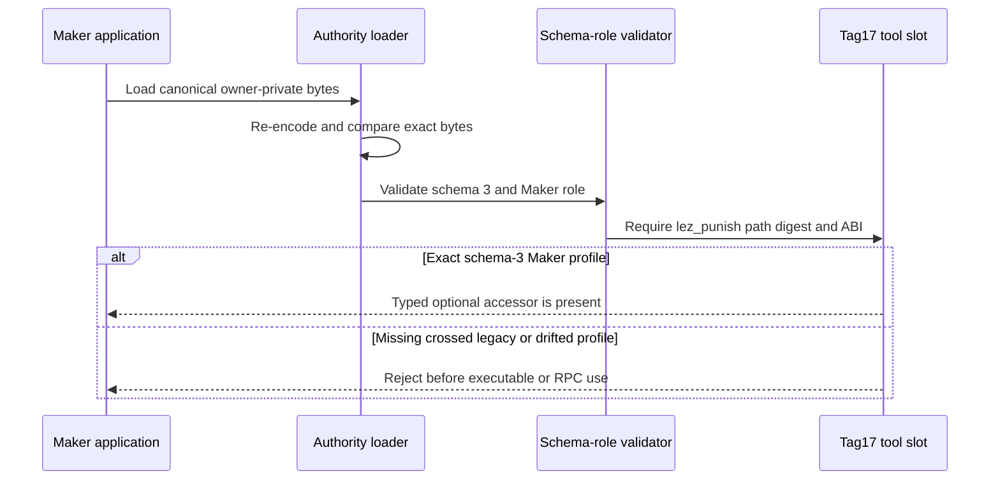

# ADR 0160: Version Maker Tag17 effect authority

- Status: Accepted as an M7 application-composition prerequisite
- Date: 2026-08-05

## Context

ADR 0159 made Tag17 a durable Maker workflow branch. The role-fixed effect
authority still had no executable slot for that step. Reusing a generic LEZ
sender or overloading the Tag15 tool would make the executable identity
ambiguous and could silently widen older application manifests.

Schema 1 is the deployed Maker profile. Schema 2 is the Taker-only Tag14
release profile. Both canonical encodings must keep their current meaning.

## Decision

Introduce effect-authority schema 3 only for Maker. It requires one explicit
`lez_punish` executable with the fixed ABI `lez_xmr_tag17_punish_v1`. The slot
is absent from canonical schema-1 and schema-2 documents. Schema 3 without the
slot, schema 1 with the slot, a Taker schema-3 profile, or ABI drift fails
closed before executable or RPC access.

The authority still pins the executable path and SHA-256 and reopens it only
through the existing secure executable descriptor at use. This decision adds
authority, not invocation: route selection and the sealed worker are separate
RED/GREEN slices.

## Components

## Validation flow

## Security and compatibility argument

The new tool cannot appear through an old schema and an old Maker manifest
cannot gain Tag17 authority by parser defaulting. Conversely, schema-1 Maker
and schema-2 Taker retain their prior canonical field sets. The exact ABI and
digest make later route selection deterministic, while at-use secure open
continues to protect against named-path replacement.

Focused tests cover valid schema 3, missing tool, wrong ABI, cross-version
injection, and unchanged schema-1 loading. They are network-free and use no
Docker, RPC, faucet, funds, or external service.
