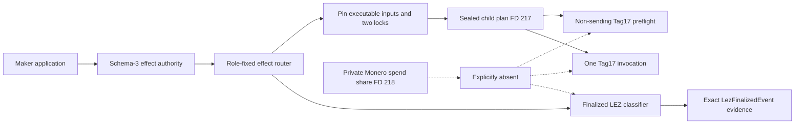
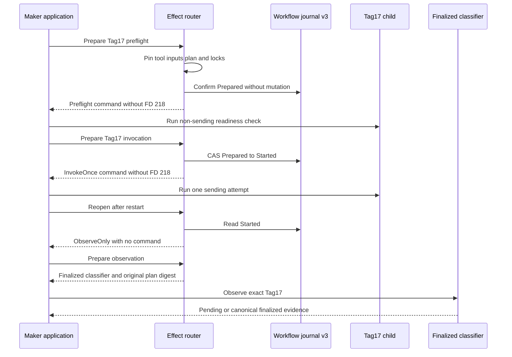

# ADR 0161: Route Tag17 with least-privilege descriptors

- Status: Accepted as an M7 application-composition checkpoint
- Date: 2026-08-05

## Context

ADRs 0159 and 0160 establish the durable Punish step and its versioned Maker
tool authority. The actor still needed to compose that authority into the same
pin-before-CAS, one-attempt, restart-observation lifecycle used by semantic
Tag14 and Tag16 effects.

Tag17 needs the validated Stage A/B binding, Maker runtime, sidecar capability,
and immutable application identity. It does not need either party's private
Monero spend share. Passing that share would violate least privilege even if
the worker ignored it.

## Decision

Allow `PunishLezTag17` preflight only for a schema-3 Maker authority. Select the
exact `lez_punish` sending tool and the existing finalized LEZ classifier as
its observer. Pin the executable, application material, canonical child plan,
both held locks, runtime, capability, and bounded RPC credentials before the
workflow CAS. Do not install private-spend-share FD 218.

Preflight is non-sending and read-only with respect to the workflow journal.
Invocation changes Prepared to Started before exposing the command. A repeated
or restarted invocation returns ObserveOnly without a command. Observation is
allowed only for Started or Unknown and retains the original sending-tool plan
digest while selecting `LezFinalizedEvent` reconciliation.

## Components

## Process flow

## Atomicity and limits

Pinning happens before the CAS, so a changed executable or input cannot burn
the only invocation authority. The CAS happens before the command is returned,
so a crash cannot authorize a second send. The observer cannot submit and its
evidence is bound to the sending-plan digest. Losing workflow branches remain
excluded by ADR 0159.

The GREEN proof uses a real role-correct Maker application, Stage A/B, Maker
adaptor journal, workflow database, inherited locks, executable descriptor,
and sealed inputs. This checkpoint used a descriptor probe and performed no RPC, Docker, faucet,
funds, or external call. ADR 0162 replaces that probe with the no-argument
semantic worker and proves authenticated prepare-only preflight plus exact
one-attempt submission against a loopback sidecar double.
