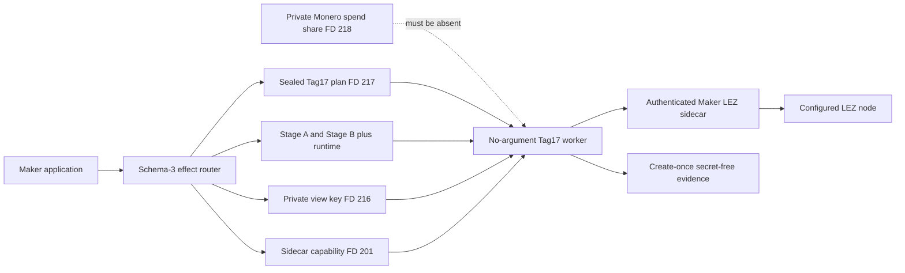
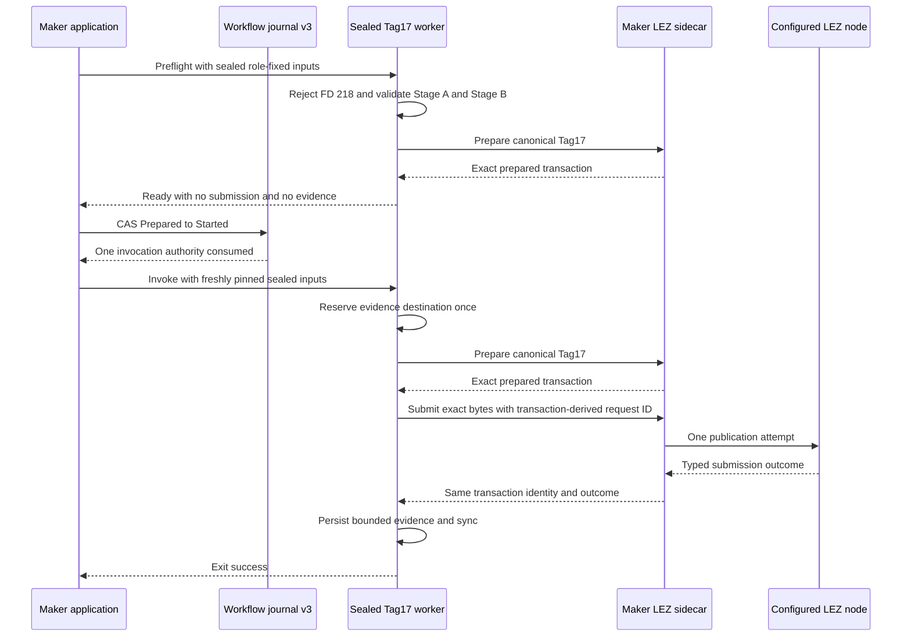

# ADR 0162: Run Tag17 through a semantic sealed worker

- Status: Accepted as an M7 semantic-process checkpoint
- Date: 2026-08-05

## Context

ADR 0161 proves that the Maker application can route Tag17 through durable
one-attempt authority and least-privilege sealed descriptors. Its child was a
descriptor probe, so it did not yet prove that the routed process validates the
application, prepares the canonical punishment, and submits that exact
transaction through the authenticated sidecar.

Tag17 requires the validated Stage A and Stage B records, Maker runtime,
private Monero view key, sidecar capability, and canonical child plan. It never
needs either participant's private Monero spend share.

## Decision

Add the no-argument `xmr-reference-tag17` worker. It accepts only sealed FDs
200, 201, 211, 212, 216, and 217; it fails before application parsing or RPC use
if private-share FD 218 is present. It requires the schema-3 Maker route,
`PunishLezTag17`, and ABI `lez_xmr_tag17_punish_v1`, then reconstructs and binds
the exact Stage A/B application to the Maker runtime.

Preflight calls only the sidecar's prepare operation and writes no evidence.
Invocation reserves an owner-private evidence destination with create-once
semantics, prepares the punishment, submits exactly those prepared transaction
bytes with a transaction-derived request ID, and records bounded secret-free
evidence. There is no automatic submission retry.

## Components

## Process flow

## Atomicity and failure limits

The application validates and pins all inputs before the workflow CAS, and the
CAS consumes invocation authority before the sending command is exposed. A
restart therefore cannot mint a second sender. Inside the worker, create-once
evidence reservation precedes publication and the transaction-derived request
ID is deterministic. If publication succeeds but the result or evidence write
is lost, the application must enter observation; it must not guess and resend.
This is one-attempt plus durable reconciliation, not a distributed transaction
across chains.

The process tests use an authenticated loopback sidecar double. They prove
prepare-only preflight, zero effects after rejected preflight, exact prepared
byte submission, bounded evidence, and rejection of FD 218 before any sidecar
call. They use no Docker, chain node, public RPC, faucet, funds, or external
service. Actual LEZ Tag17 publication and finality remain separately proven by
the isolated actual-node certificate recorded in ADR 0158. A joined funded
Monero abandonment corridor and adverse crash, concurrency, fee, and reorg
matrix remain later M7 repository work.
