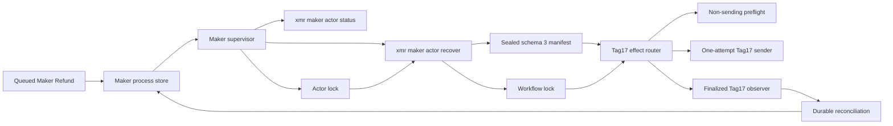
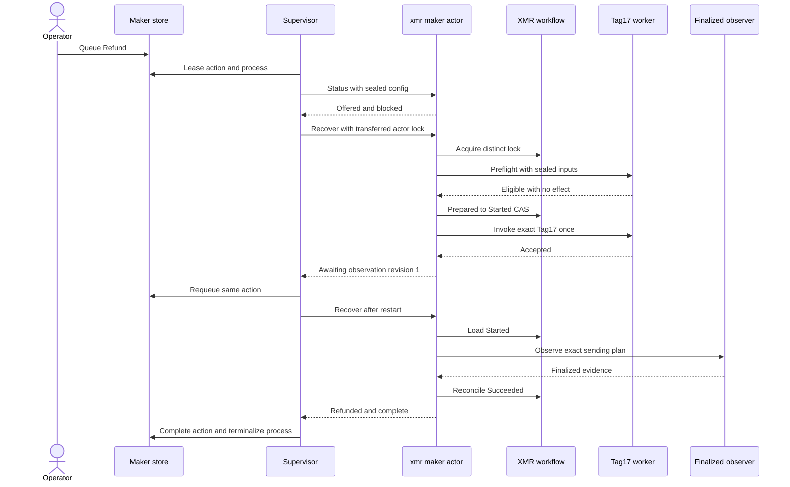

# ADR 0163: Supervise Maker Tag17 recovery through the role actor

- Status: Accepted as an M7 application-composition checkpoint
- Date: 2026-08-04

## Context

ADRs 0159 through 0162 supplied the durable punishment branch, schema-3 Maker
authority, least-privilege route, and semantic Tag17 worker. The normal Maker
supervisor still stopped at the schema-2 no-effect status boundary. A generic
effect command could not safely bridge the gap: the supervisor already owned
the per-swap actor lock, while the semantic worker also required that exact
lock plus the distinct workflow lock.

## Decision

The supervisor accepts schema-3 Maker manifests and maps only an explicitly
queued Monero Refund action to xmr-maker-actor recover. It transfers an owned
duplicate of the already-held actor lock on standard input. The actor safely
clones that descriptor, revalidates the deterministic named inode and existing
exclusive lock, and acquires a separate workflow lock. Status and every
non-Monero or non-effect child retain null standard input.

The role actor then:

1. fully validates the sealed schema-3 application and effect authority;
2. runs the non-sending Tag17 preflight while the workflow is Prepared;
3. consumes the one-attempt workflow CAS and runs the pinned semantic worker;
4. reports awaiting-observation from the exact durable revision;
5. on restart, selects only the pinned finalized observer and never the sender;
6. reconciles nonzero finalized evidence and reports terminal refunded from
   the exact durable revision.



The standard-input transfer is not a path reopen. Both child descriptors refer
to the same open file description already locked by the supervisor. Reopening
/proc/self/fd/198 would create a different open file description and can
conflict with the live lock, so that design is rejected.

## Restart and effect flow



## Atomicity and failure argument

This change preserves conditional atomicity; it does not claim a distributed
transaction across LEZ and Monero.

- Branch selection is durable and mutually exclusive. A queued recovery cannot
  select Claim after Punish was selected.
- Preflight is read-only and precedes the invocation CAS. Failure consumes no
  send authority.
- The CAS changes Prepared to Started before the sender runs. Spawn, timeout,
  wait, or nonzero-exit ambiguity changes Started to Unknown; neither Started
  nor Unknown can send again.
- Only the role-fixed finalized observer with the original nonzero tool-plan
  digest can move Started or Unknown to Succeeded.
- The supervisor retains the actor lock for the whole scheduling attempt, and
  the actor retains both locks while every nested worker runs. A concurrent
  actor or crossed workflow therefore fails before effect preparation.
- Tag17 receives Stage A and B, runtime, credentials, and plan through sealed
  descriptors, but never receives the private Monero spend share.
- The terminal operator result is committed only after durable finalized LEZ
  reconciliation. Until then the action remains queued.

The focused process test uses a strict local descriptor worker and finalized
observer. It proves application ownership, lock custody, one submission, restart
observation, and terminal persistence, but contacts no chain RPC. ADR 0158 is
the separate actual-node Tag17 finality proof. A fresh joined two-devnet
abandonment journey is still required to prove the whole economic corridor.

## Verification

```text
cargo test -p lez-maker-node --test maker_xmr_tag17_supervisor \
  real_maker_actor_executes_both_recovery_branches_once_then_reconciles -- --exact
cargo test -p lez-maker-node --test maker_actor_supervisor \
  queued_xmr_recover_overrides_typed_blocked_status_without_generic_effect -- --exact
cargo test -p lez-maker-node xmr_recover_effect_is_exactly_nonterminal_until_finalized -- --exact
```

The first test emulates the real operator role and normal daemon scheduler. Its
effect worker is local and deterministic. It uses no Docker, chain node, RPC,
faucet, DNS, public funds, peer, or public deployment. Cold Cargo compilation,
CPU-heavy cryptographic fixture construction, filesystem synchronization, and
host scheduling can change duration but cannot supply missing evidence.
