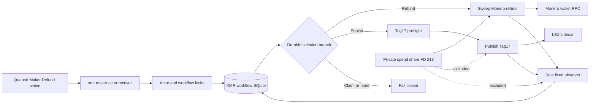
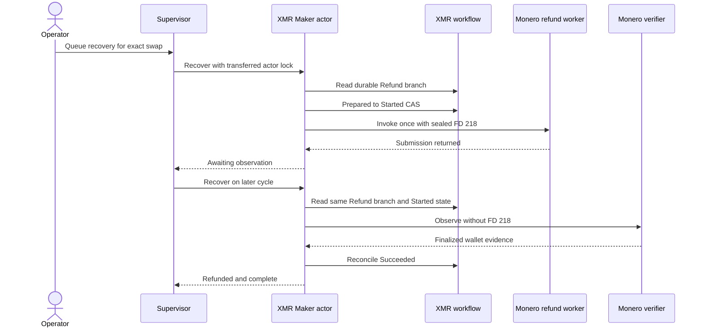
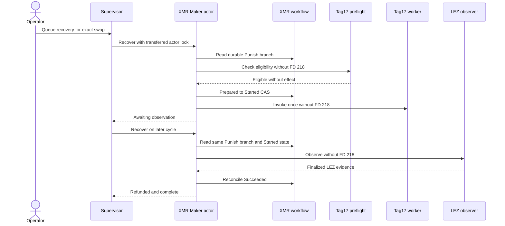

# ADR 0164: Select Maker recovery only from the durable workflow branch

- Status: Accepted as an M7 application-composition checkpoint
- Date: 2026-08-04

## Context

ADR 0163 joined the normal Maker supervisor to the schema-3 Tag17 route, but
the role actor still hard-coded Tag17 for every `recover` command. The durable
workflow already distinguishes mutually exclusive Refund and Punish branches.
Ignoring that authority could route a valid Maker Monero refund into the wrong
effect. Operator input must request recovery, not choose the chain effect.

## Decision

The Maker actor validates the complete workflow identity and reads the selected
branch from the existing SQLite journal while holding the transferred actor
lock and separate workflow lock. It maps Refund to `SweepMoneroRefund`, Punish
to `PunishLezTag17`, and rejects Claim or an unselected branch. Every invocation,
observation, ambiguity transition, evidence reconciliation, and reported
revision uses that selected step.

Tag17 alone runs its non-sending semantic preflight. The Monero refund sweep
goes directly through the existing Prepared-to-Started one-attempt CAS. Its
sending child receives the sealed private spend share on FD 218; the Tag17
child and both read-only observers reject FD 218.



## Recovery sequences and atomicity



The Refund path is conditionally atomic because the irreversible branch was
selected before effect preparation, the CAS consumes the only send authority
before the external call, and Started or Unknown can only observe the original
tool-plan identity. A crash cannot re-enter the sender. The private share is
available only to the role-fixed sending child and cannot be exposed to the
read-only verifier. ADR 0166 subsequently closes the semantic Maker Monero sender. This process checkpoint does not prove a fresh joined two-devnet abandonment corridor; that remains repository-controlled M7 work.



The Punish path retains ADR 0163's atomicity argument: preflight is read-only,
the same one-attempt CAS precedes submission, and only finalized evidence for
the original plan completes the workflow. Refund and Punish are mutually
exclusive in the durable branch row, so one recovery command cannot authorize
both.

## Verification and resources

```text
cargo test -p lez-maker-node --bin xmr-maker-actor \
  maker_recovery_step_is_derived_only_from_the_durable_branch
cargo test -p lez-swap-store \
  durable_step_revision_tracks_ambiguity_and_reconciliation
cargo test -p lez-maker-node --test maker_xmr_tag17_supervisor \
  real_maker_actor_executes_both_recovery_branches_once_then_reconciles
```

The real actor/supervisor integration uses signed deterministic application
material and strict local descriptor workers. It opens no Docker container,
chain node, RPC, faucet, DNS, peer, public funds, or public deployment. The
Tag17 trace is `preflight, invoke, observe`; the Refund trace is `invoke,
observe`. The 237.52-second measured run was dominated by cryptographic fixture
and repeated authority validation, so CPU and storage contention can change its
duration but external-network availability cannot change its result.
