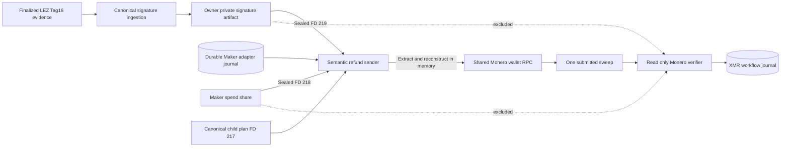
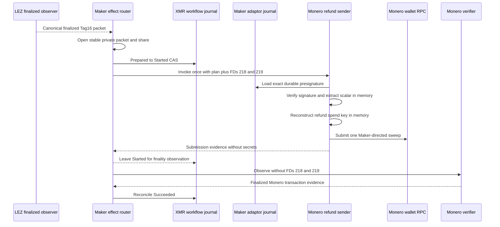

# ADR 0165: Seal the finalized refund signature for in-memory extraction

- Status: Accepted as an M7 Monero-refund prerequisite
- Date: 2026-08-04

## Context

The branch-aware Maker actor can authorize the Monero refund route, but the
semantic sender must reconstruct the refund spend key from the Maker share and
the adaptor scalar revealed by finalized LEZ Tag16. Passing a previously
extracted scalar through a file would create another long-lived secret and
would separate extraction from the exact durable presignature that authenticates
it. Restart observation must not receive either reconstruction input.

## Decision

The existing finalized-Tag16 ingestion boundary writes one canonical,
owner-private `finalized-refund-signature.json` artifact in the effect evidence
directory. When and only when the durable branch selects
`SweepMoneroRefund`, the parent opens that file with the existing stable-private
source checks, seals its bytes, and maps it to FD 219 alongside the sealed Maker
share on FD 218. Both are pinned before the Prepared-to-Started CAS. The child
will verify the final signature against the validated session and the exact
presignature in the existing role journal, extract the adaptor scalar in
memory, reconstruct the spend key in memory, and submit the sweep. No extracted
scalar file is accepted or created.

The read-only Monero verifier receives neither FD 218 nor FD 219. Tag17 and all
other routes receive neither finalized-signature material nor any new
capability. Missing, replaced, linked, oversized, role-crossed, or invalid
inputs fail before the external send authority is consumed.



## Flow and conditional atomicity



Atomicity remains conditional across independent chains. Tag16 is the only
accepted LEZ outcome that reveals the Taker adaptor scalar needed to combine
with the Maker share, so the Maker can reconstruct the Monero refund key only
after the signed LEZ refund branch is finalized. The durable branch excludes
Claim and Punish, while the pre-send CAS excludes a second submission after a
crash. Pinning both reconstruction inputs before that CAS avoids consuming send
authority and then discovering a missing or replaced source. Observation is
capability-separated and cannot reconstruct or resend. This checkpoint proves
custody and transcript-bound extraction; the semantic RPC sender and joined
two-devnet replay remain the next repository-controlled work.

## Verification and resources

```text
cargo test -p lez-adaptor-role-runner --test role_process \
  lez_roles_restart_between_phases_reject_crosswire_and_replay_exact_partial
cargo test -p xmr-reference-actor --test effect_route \
  maker_refund_route_receives_signature_and_share_only_for_invocation
```

These focused tests use local processes, SQLite journals, deterministic signed
fixtures, and inherited descriptors only. They use no Docker container, chain
node, RPC, faucet, DNS, peer, public funds, or public deployment, so external
availability cannot make this checkpoint flaky.
