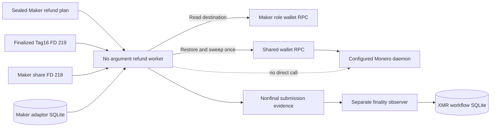
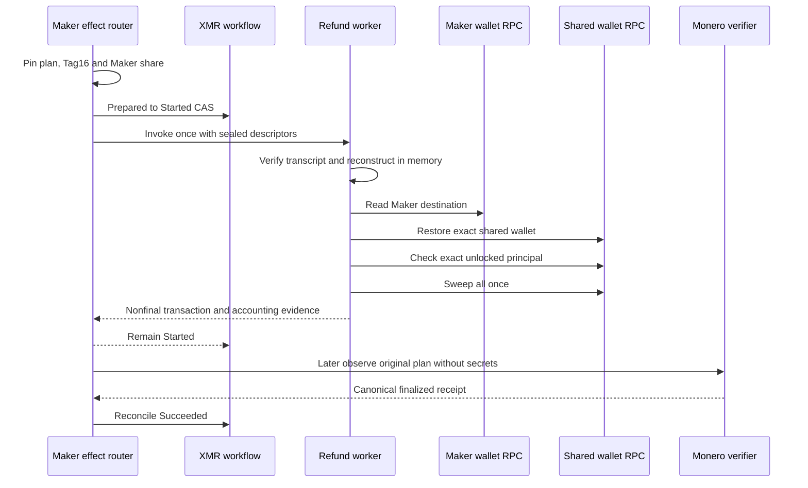

# ADR 0166: Submit the Maker Monero refund without mining or waiting

- Status: Accepted as an M7 semantic-worker checkpoint
- Date: 2026-08-04

## Context

ADR 0165 made refund-key reconstruction transcript-bound and invocation-only.
The existing Regtest sweep adapter still combined wallet restoration, sweep
submission, ten generated blocks, and confirmation reporting in one call. That
shape is useful for isolated corridor scripts but is unsafe for a durable
application sender: it keeps the one-attempt child alive through finality and
gives it a daemon mining capability that a production deployment does not have.

## Decision

The maintained typed Monero adapter now exposes
`restore_shared_and_sweep_once`. It preserves all filename, credential,
address, view-key, reconstructed-key, exact-balance, single-transaction and
exact-accounting checks, but returns a deliberately non-final submission
receipt before any confirmation operation. The existing
`restore_shared_and_sweep` API calls the new method and then mines, preserving
all older local-runner behavior.

The new no-argument `xmr-reference-monero-refund` child accepts only the
compiled Maker/Invoke/Refund ABI. It validates sealed Stage A/B and runtime,
requires the exact durable Maker presignature, parses finalized Tag16 from FD
219, extracts and reconstructs in memory with FD 218, obtains the destination
from the Maker role wallet, and submits through the independent shared-wallet
RPC exactly once. It writes create-once secret-free submission evidence. It
does not call the daemon, mine, wait, classify finality, or retry.



## Flow and conditional atomicity



Atomicity is conditional, not a cross-chain database transaction. Finalized
Tag16 supplies the only DLEQ-checked Taker scalar that combines with the Maker
share; the durable Refund branch excludes Claim and Punish; and the parent CAS
consumes the only submission authority before starting the child. If the child
or host fails after an ambiguous wallet call, restart observes and never sends
again. Separating finality prevents a slow or unavailable chain from extending
the sending capability. The joined real-node replay must still prove discovery
and reconciliation of the exact submitted transaction after process failure.

## Verification and resources

```text
cargo test -p xmr-reference-actor --test tag16_process \
  sealed_maker_refund_reconstructs_and_submits_once_without_mining_or_finality_wait
cargo test -p xmr-reference-actor --test tag16_process \
  sealed_maker_refund_rejects_invalid_final_signature_before_any_rpc
cargo test -p lez-xmr-monero-adapter --locked
```

The process test uses separate ephemeral loopback JSON-RPC fixtures for the
Maker role wallet, shared wallet, and daemon authority. Only the two wallet
fixtures are contacted; the daemon records zero requests, proving the sender
does not generate blocks or wait for finality. Signed application, adaptor and
DLEQ material is deterministic and all files are temporary. No Docker, real
node, faucet, DNS, peer, public funds, public RPC or public deployment is used.
