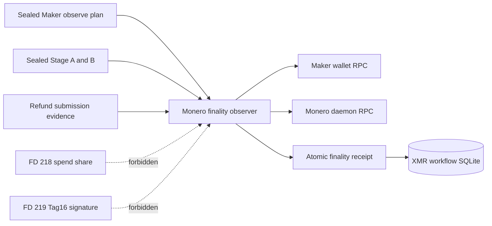
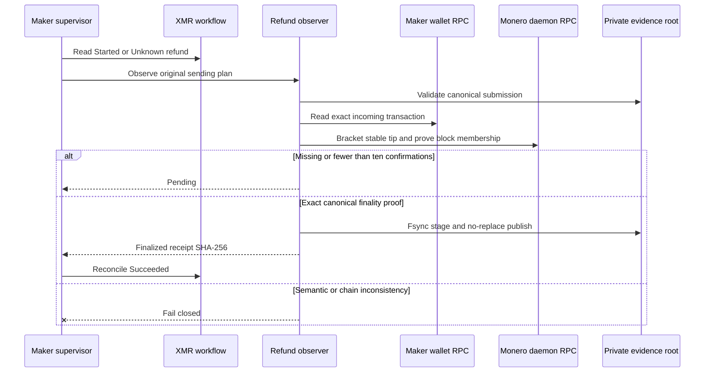

# ADR 0167: Observe the Maker Monero refund without spend authority

- Status: Accepted as an M7 finality-observer checkpoint
- Date: 2026-08-04

## Context

ADR 0166 separated the one-shot refund sweep from confirmation waiting, but the
schema-3 Maker authority still named a placeholder `lez_xmr_monero_verify_v2`
observer. A restart could therefore route to observation without a real
process capable of proving the exact transaction, destination, amount,
canonical block and confirmation depth. Reusing the sender would also expose
the Maker share and finalized Tag16 to a process that must never spend.

## Decision

`xmr-reference-monero-verify` implements the existing observer ABI. It accepts
only the parent-selected `sweep_monero_refund` step and the sealed
Maker/Observe plan. It validates Stage A/B, the sender's canonical create-once
submission and its original sending-plan digest. FD 218 and FD 219 are
explicitly forbidden. The observer constructs the maintained typed
`MoneroOutputVerifier` over the separately authenticated Maker-wallet and
daemon origins.

Only absence, mempool, lock and shallow-confirmation results are `pending`.
Amount, destination, transaction, double-spend, chain identity, stable-tip,
membership and consistency mismatches fail closed. A finalized observation is
published through fsynced staging and `RENAME_NOREPLACE`; every restart
re-observes the chain and requires an existing receipt to byte-match the newly
derived receipt before returning its SHA-256 to the workflow.



## Flow and conditional atomicity



This preserves conditional swap atomicity by keeping submission authority
consumed after the parent CAS: restart can only observe the same transaction
and cannot reconstruct or resubmit the refund. The receipt alone cannot make
an unconfirmed or different transaction final because its contents are
re-derived from the typed canonical-chain observation on every run. The
cross-chain argument still depends on finalized Tag16 disclosing the Taker
scalar, exclusive durable Refund branch selection, exact Stage-B terms and the
Monero ten-confirmation policy. It is not a claim that LEZ and Monero share one
transactional commit.

## Verification and resources

```text
cargo test --locked -p xmr-reference-actor --bin xmr-reference-monero-verify
cargo test --locked -p xmr-reference-actor --test tag16_process \
  sealed_maker_refund_observer
cargo clippy --locked -p xmr-reference-actor --all-targets -- -D warnings
```

The deterministic process tests use temporary signed application material,
SQLite and independent ephemeral loopback JSON-RPC fixtures. They prove
forbidden-secret and changed-submission rejection before RPC. The final
canonical-chain happy path is deliberately left to the fresh joined official
Monero Regtest replay; this checkpoint alone uses no Docker, node, faucet,
peer, DNS, public RPC, public funds or public deployment.
