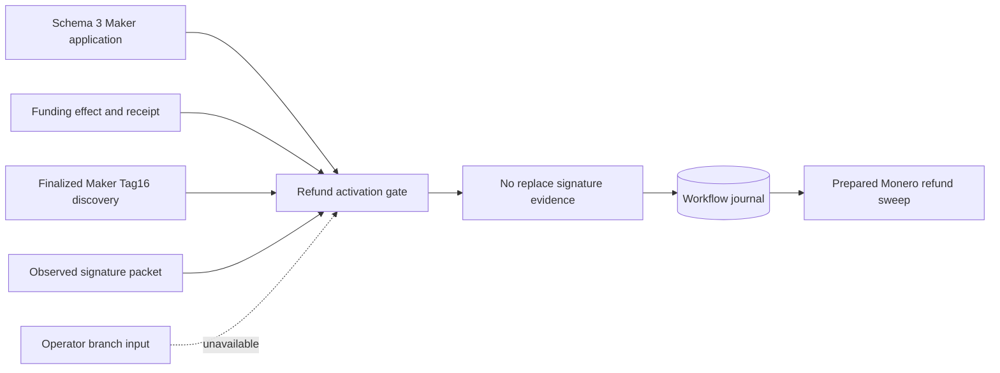
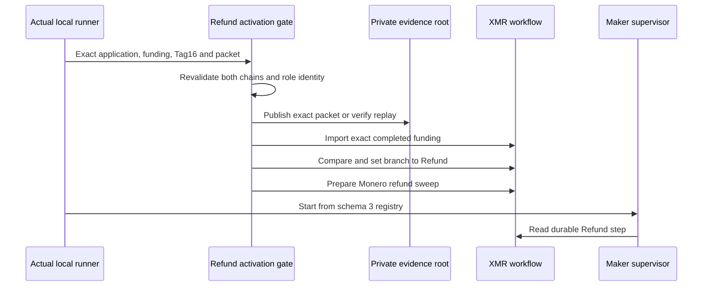

# ADR 0168: Activate Maker refund only from finalized evidence

- Status: Accepted as an M7 application checkpoint
- Date: 2026-08-04

## Context

The schema-3 Maker supervisor can route a durable Refund branch, but the actual
application runner previously selected workflow branches only in fixtures.
Accepting refund from an operator or script would let orchestration state claim
a recovery outcome before the corresponding Tag-16 was finalized. The workflow
also begins before the existing actual-local Monero funding effect, so that
already-completed common step needs an exact, replay-safe import.

## Decision

The xmr-reference-actor activate-maker-refund-workflow command exposes no
branch argument. It revalidates the complete schema-3 Maker application and
immutable effect authority, exact Stage A/B, canonical one-shot Monero funding
evidence, an independent ten-confirmation wallet/daemon receipt, Maker-sidecar
DiscoverByTerms finalized Tag-16 facts, and the signature packet already
validated against the refund session. Every identity, amount, transaction,
chain, role, run, topology and external-resource field must agree.

The finalized signature is copied byte-for-byte into the fixed effect evidence
root using create-new publication or exact replay. The command then imports
funding as a durable Succeeded common step with domain-separated evidence and
tool-plan digests, selects only Refund through the journal compare-and-set, and
prepares sweep_monero_refund. Exact partial replay advances forward. A previous
Claim or Punish winner fails closed; no losing branch is overwritten.

## Flow and conditional atomicity

Conditional atomicity is preserved because finalized Tag-16 is the only input
that can select Refund, and its aggregate signature discloses the Taker adaptor
share needed by the Maker refund sweep. The branch CAS excludes Claim and
Punish, the funding import proves the shared Monero output existed first, and
the later sender still consumes its only attempt before wallet submission.
Filesystem and SQLite are not one distributed transaction: publication occurs
first because the signature is public in finalized LEZ history and harmless on
a losing branch, whereas selecting Refund without the required child input
could strand a concurrently running supervisor. A crash at any boundary is
therefore replayable without rearming a chain send.

## Verification and resources

    cargo test --locked -p xmr-reference-actor --test provision
    cargo check --locked -p xmr-reference-actor --all-targets
    cargo clippy --locked -p xmr-reference-actor --all-targets -- -D warnings

The component gate performs no RPC or chain mutation. It consumes existing
owner-local evidence from isolated LEZ and official Monero Regtest processes.
The joined runner replay remains the proof that those files arise from the
actual nodes and that the normal supervisor completes the two-leg recovery.
