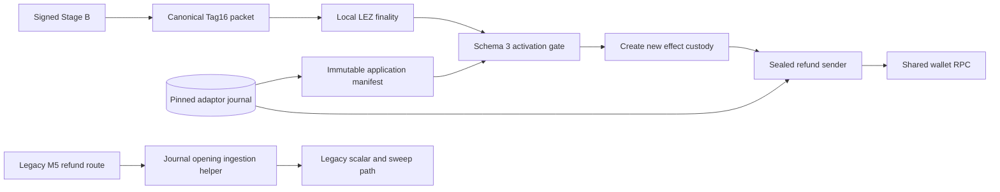
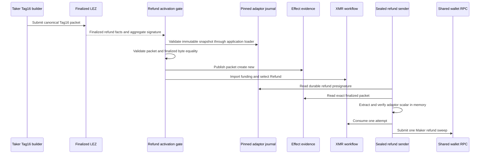

# ADR 0169: Preserve the pinned adaptor journal through refund activation

- Status: Accepted as an M7 application checkpoint
- Date: 2026-08-05

## Context

The schema-3 Maker application pins the exact adaptor-journal bytes before any
effect is admitted. The joined runner originally reused the legacy M5
`ingest-finalized-refund-signature` helper immediately before schema-3
activation. Although that helper does not update protocol rows, it opens the
original SQLite file through the configured read-write, WAL, migration and
checkpoint path. That is incompatible with subsequently revalidating the
pre-effect byte digest and sidecar-free snapshot.

The Tag-16 preparation already creates the canonical final-signature packet
that is submitted on LEZ. Finalized Maker-side discovery returns the same
aggregate signature. The schema-3 activation gate verifies packet syntax,
session identity, signature validity and byte equality with finalized facts,
then publishes it create-new into the effect evidence root. The sealed refund
sender later verifies the exact durable presignature relationship and performs
in-memory extraction before any wallet RPC.

## Decision

The supervised schema-3 route passes the existing canonical Tag-16 packet
directly to the evidence-driven activation gate. It does not open the pinned
adaptor journal between finality and application validation. The legacy M5
route retains the existing ingestion helper and explicit scalar-extraction
flow.

This is a custody split, not a relaxed validation:

1. Tag-16 preparation constructs and publishes the exact aggregate signature.
2. finalized Maker discovery proves those bytes were accepted in the signed
   refund window;
3. activation revalidates the immutable application, exact finalized facts and
   canonical packet, then copies it create-new into effect custody;
4. the sealed sender receives the pinned journal snapshot, packet and Maker
   share, verifies extraction in memory, consumes the one-attempt CAS and only
   then contacts the shared wallet.

## Flow and atomicity

Atomicity is preserved because no Monero refund is possible from packet
handoff alone. Refund selection still requires finalized Tag-16 and confirmed
funding; Claim and Punish remain mutually exclusive in the durable workflow.
The sender validates the presignature relationship before its only wallet
submission, and the restart observer receives neither the private share nor
the finalized-signature descriptor.

## Verification and limits

The focused runner contract requires the supervised branch to use the existing
canonical packet and keeps legacy ingestion only in the legacy branch. Bash
syntax, the legacy ingestion tests and all schema-3 effect-route tests are
GREEN. Exact run `m7refund-3e513ab-a` reached finalized Tag-16 and stopped at
pre-activation application validation before any refund send; exact cleanup
passed. A fresh pushed-commit replay is still required to prove the corrected
joined actual-node route through terminal observation.
