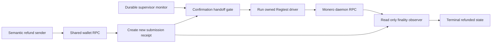
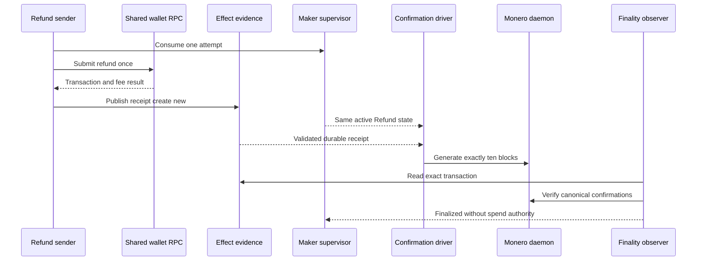

# ADR 0170: Drive refund confirmations from durable submission evidence

- Status: Accepted as an M7 application checkpoint
- Date: 2026-08-05

## Context

Exact joined run `m7refund-8f836c7-a` cleared schema-3 registration,
real Monero funding and independent verification, the signed refund window,
finalized Tag16 and evidence-driven activation. The semantic Maker child then
submitted transaction `b34c5fcbde4e9f7c8617e6e2286f7aad8230fa8253fd67b50f1f437dcc02ff0e`
once and published the create-new submission receipt.

The runner waited for the supervisor to expose `schedule_state=queued` before
invoking its separate Regtest confirmation driver. That state is transient:
the daemon polls every 20 milliseconds and can immediately re-lease the actor.
After the receipt existed, the exact run repeatedly exposed `leased` and
`backoff` while preserving the same active Maker recovery and manual Refund
action. The driver therefore never started even though submission was durable
and retry authority had already been consumed.

The submission receipt is published only after the typed wallet RPC returns
and its transaction, amount and fee evidence are validated. Replays encounter
the same create-new evidence and cannot obtain a second one-shot submission
authority.

## Decision

The joined runner admits its external confirmation driver from durable
submission evidence rather than a transient scheduler window. It requires all
of the following before continuing:

1. the create-new submission receipt exists;
2. the monitor still identifies the same active Maker recovery at revision 1;
3. the same manual Refund action is queued or leased;
4. scheduler state is queued, leased or backoff;
5. the receipt validates the exact run and swap, requires the finality
   observer, disables automatic retry and names no public RPC or faucet.

Only after those checks does the run-owned driver mine exactly ten local
Regtest blocks. Terminal success still requires the spend-authority-free
observer to publish exact finality and the supervisor to complete the manual
action.

## Flow and atomicity

Atomicity is unchanged. Finalized Tag16 and confirmed shared funding still
select Refund before the sender can run. The sender consumes its one-attempt
authority before the wallet RPC, and receipt publication happens after that
RPC succeeds. Mining while a replay worker is leased cannot authorize another
send: the durable attempt CAS and create-new receipt already exist. The
confirmation driver holds only run-owned Regtest mining credentials, while
the observer receives neither the private share nor the finalized-signature
descriptor.

## Verification and limits

The focused runner contract was RED against the queued-only gate and is GREEN
with the durable receipt plus replay-safe scheduler states. Bash syntax and
diff hygiene pass. Exact run `m7refund-8f836c7-a` proves the path through one
real refund submission and exact cleanup; it was interrupted before any
confirmation mining after the transient-state race was established. A fresh
pushed-commit replay must still prove ten confirmations and terminal
observation.
