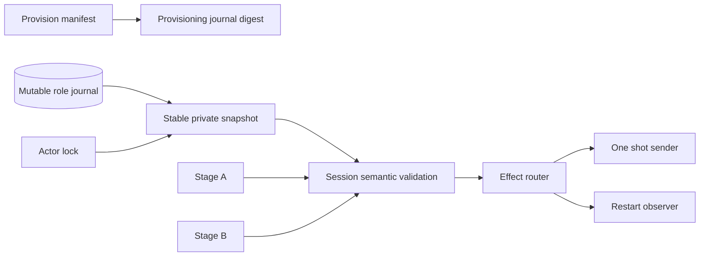
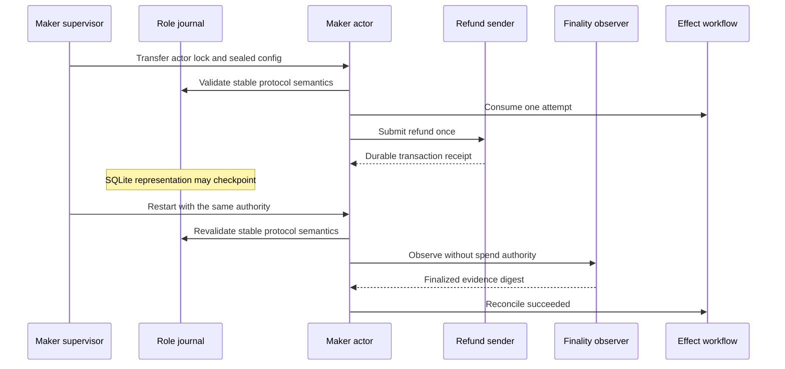

# ADR 0171: Validate mutable role journals semantically across restarts

- Status: Accepted as an M7 application checkpoint
- Date: 2026-08-05

## Context

Exact pushed run `m7refund-e7016d8-a` proved the durable submission handoff in
ADR 0170. It submitted one Maker Monero refund, retained the same transaction
receipt, and mined exactly ten Regtest blocks. The Maker wallet and daemon both
reported the exact incoming output at ten confirmations.

The restart-only observer never ran. Every later actor cycle failed while
loading the schema-3 application with `role journal digest differs from
provision manifest`. The manifest recorded a SHA-256 of the SQLite role journal
at provisioning. Opening that mutable database during the sending cycle can
checkpoint or otherwise rewrite SQLite representation bytes without changing
any swap authority or protocol state. Treating that provisioning digest as a
permanent runtime invariant therefore made a valid durable restart impossible.

## Decision

The role-journal digest remains canonical provisioning provenance. It is not a
runtime immutability claim for the mutable SQLite representation.

Every restart still reads a stable owner-only single-link snapshot, rejects
WAL, shared-memory and rollback sidecars, validates the complete claim and
refund session identities, transcripts, nonces, partial signatures,
presignature and role-specific phases against Stage A and Stage B, and
revalidates the named source around that operation. Immutable Stage wires,
packets, private manifest, view key, effect authority and executable remain
byte-digest pinned.

## Restart flow and atomicity

Atomicity does not depend on raw SQLite page bytes. It depends on the validated
session transcript and signatures, the exclusive actor lock, the durable
workflow branch and one-attempt CAS, create-new submission evidence, and
finalized chain observation. A semantic journal mismatch still fails before an
effect. A representation-only rewrite cannot rearm an attempt or change the
selected branch.

## Verification and limits

The regression performs a real refund invocation, rewrites the same valid role
journal with SQLite `VACUUM`, proves the file digest changed, and then requires
the restart route to select ObserveOnly and run its least-privilege observer.
It was RED with the provisioning-digest runtime check and is GREEN with semantic
restart validation. The complete XMR reference-actor suite is GREEN.

The normal-supervisor process proof is also GREEN in 302.10 seconds. Its
updated fixture supplies and asserts the private spend share on FD 218 and the
finalized Tag16 signature on FD 219 only for refund invocation; the restart
observer receives neither. Tag17 and Monero Refund both invoke once and
reconcile after restart.

Run `m7refund-e7016d8-a` is diagnostic evidence, not a successful corridor: it
proved one send and ten locally mined confirmations but did not terminalize.
A fresh pushed-commit replay must still produce finality evidence, revision 2,
completed manual action, terminal scheduler state, and exact cleanup.
