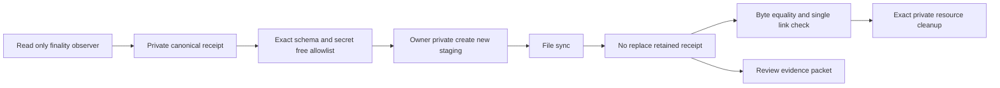
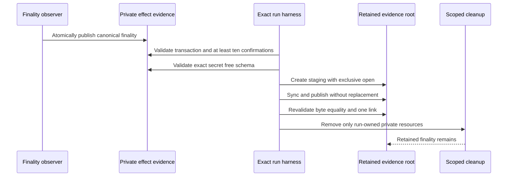

# ADR 0172: Retain refund finality before scoped cleanup

- Status: Accepted as an M7 evidence checkpoint
- Date: 2026-08-05

## Context

Exact pushed run `m7refund-d6ebaaf-a` completed the joined Maker refund: one
semantic wallet submission, exactly ten Regtest confirmation blocks, read-only
wallet and daemon observation, workflow revision 2, a completed manual
Refund action, terminal scheduler state, and exit-status-zero exact cleanup.

The observer's canonical `monero-refund-finalized.json` lived under the private
effect directory. The runner validated it before terminal success, but scoped
cleanup then removed that directory. Retained submission, mining and terminal
receipts prove the functional result, but an immutable review packet must also
retain the exact secret-free finality receipt it claims to have validated.

## Decision

After semantic validation and before stopping the Maker daemon, the runner
copies the private finality receipt to the run evidence root. It first enforces
an exact field allowlist and local-only flags. Staging uses an owner-private
`O_EXCL` file, fsync, no-replace hard-link publication, staging unlink, final
fsync, single-link validation, and byte comparison with the source. Any
existing destination, unknown field, unsafe file, changed byte, or publication
failure makes the run fail before cleanup reports success.

## Flow and atomicity

This handoff does not add chain authority or make the two chains a distributed
transaction. The sender still has the sole consumed spend attempt, the observer
still has no spend material, and cleanup still targets only ledgered run-owned
resources. Evidence publication occurs only after finalized chain validation;
it cannot authorize, retry, or change the refund.

## Verification and limits

The focused contract progressed RED because no retention function or call
existed. GREEN executes the real filesystem handoff, checks byte identity,
mode `0600`, one link, and rejection of replacement. Shell syntax and diff
hygiene pass. Exact pushed-commit run `m7refund-7cd3a9c-a` then retained the
canonical receipt across source-status-zero exact cleanup, which removed the
private source and every run-owned Docker resource. The checked packet is
[`m7-actual-maker-refund-7cd3a9c-20260805.json`](../evidence/m7-actual-maker-refund-7cd3a9c-20260805.json);
`m7refund-d6ebaaf-a` remains functional diagnostic evidence only.
