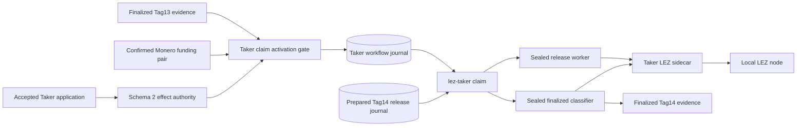
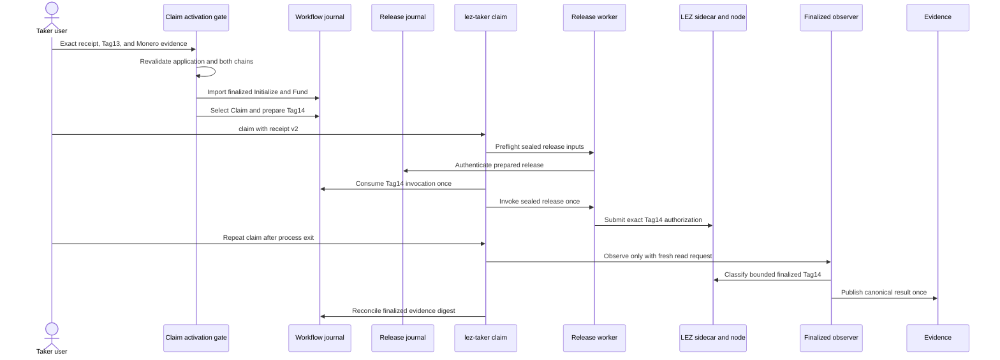

# ADR 0173: Activate and observe Taker Tag14 from receipt v2

- Status: Implemented; fresh actual-node replay pending
- Date: 2026-08-05

## Context

The actual local XMR claim runner already completed both chain legs, but it
published Tag14 through the release-service path directly. The user-facing
receipt-v2 Taker route separately proved sealed preflight, one invocation and
restart-only observation with process doubles. Neither proof joined the real
application receipt to the actual LEZ and Monero prerequisites.

## Decision

`activate-taker-claim-workflow` accepts no branch selector. It revalidates the
schema-2 Taker effect application, Stage A/B, canonical finalized Tag13
Initialize/Fund evidence, and the independent confirmed Monero funding
evidence/receipt. It imports the two role-local LEZ effects as exact durable
reconciliations, selects Claim, and prepares only `authorize_lez_tag14`.

The isolated runner upgrades the accepted Taker application to receipt v2 only
after the release journal is prepared from both-chain prerequisites. The real
`lez-taker claim --receipt` command then preflights and invokes the existing
release service once. Later invocations are read-only and use a sealed
finalized classifier. The observer scans from the finalized Tag13 funding
successor, publishes one owner-private canonical Tag14 receipt, and returns
only its digest to workflow reconciliation.

The opt-in switch is `M7_XMR_SEMANTIC_CLAIM=1`; it requires application mode
and the Claim journey. Existing claim and refund defaults are unchanged.

## Components

## User flow and conditional atomicity

Tag14 cannot be activated from an operator-selected branch: the gate requires
the finalized Taker Tag13 effects and exact confirmed shared Monero output.
The release journal independently binds the same prerequisites and preserves
its post-CAS clock gate and one-attempt publication rule. The outer workflow
and inner release journal are monotonic nested authorities, not a distributed
database transaction. A crash before either CAS is replayable; after the
workflow CAS the release journal cannot rearm; after possible publication the
Taker command is observation-only.

This establishes conditional atomicity for authorization: the Maker can claim
LEZ only after the Taker has locked LEZ and the Maker's exact Monero lock is
confirmed. It does not by itself prove Tag15, Taker Monero sweep, reorg
resistance, or adverse process/concurrency recovery. Those claims require the
joined actual-node replay and later hardening evidence.

## Verification and resources

Focused provisioning tests, both existing actual-runner contracts, formatting,
compile checks, and strict Clippy are GREEN. The new mode has not yet completed
a clean commit-pinned actual-node replay, so this ADR records implementation,
not milestone certification.

The first source-bound replay of commit `aae5c5c` proved the checked LEZ
deployment, both finalized actor claims, the Monero 0.18.5.1 topology, and the
agreement/application handoff before stopping prior to Tag13. Its RED was a
runner evidence-type defect: Bash supplied numeric `0` to jq, where every
number is truthy, instead of the required JSON boolean `false`. Exact cleanup
passed. The follow-up emits explicit booleans and retains byte-identical safe
activation and Tag14-finality evidence outside the private cleanup boundary;
a fresh commit-bound replay remains required.

The planned replay uses only dynamically allocated literal-loopback endpoints,
the repository-pinned local LEZ v0.2 stack, official Monero 0.18.5.1 Regtest,
deterministic local funds, and exact run-labelled cleanup. It uses no public
RPC, faucet, peer, public funds, DNS dependency, or public deployment.
