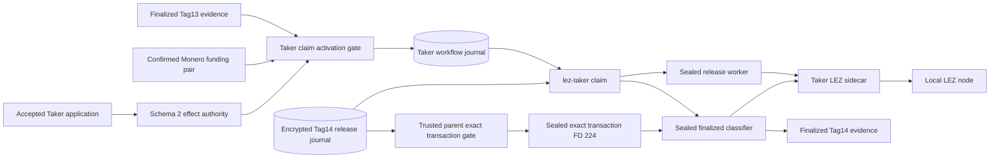
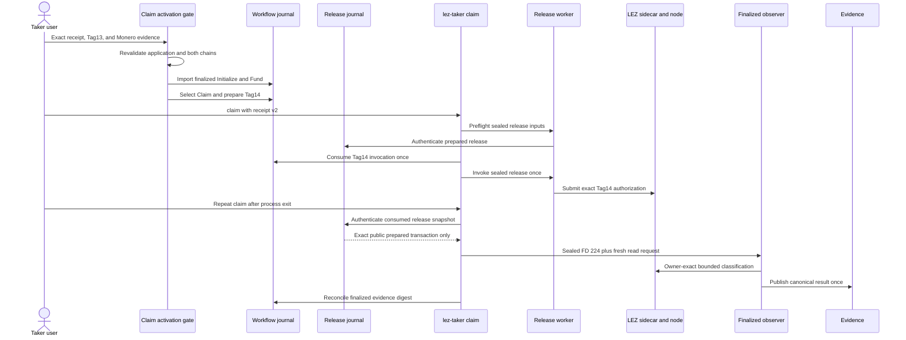

# ADR 0173: Activate and observe Taker Tag14 from receipt v2

- Status: Implemented; fresh actual-node replay pending
- Date: 2026-08-05

## Context

The actual local XMR claim runner already completed both chain legs, but it
published Tag14 through the release-service path directly. The user-facing
receipt-v2 Taker route separately proved sealed preflight, one invocation and
restart-only observation with process doubles. Neither proof joined the real
application receipt to the actual LEZ and Monero prerequisites.

## Decision

`activate-taker-claim-workflow` accepts no branch selector. It revalidates the
schema-2 Taker effect application, Stage A/B, canonical finalized Tag13
Initialize/Fund evidence, and the independent confirmed Monero funding
evidence/receipt. It imports the two role-local LEZ effects as exact durable
reconciliations, selects Claim, and prepares only `authorize_lez_tag14`.

The isolated runner upgrades the accepted Taker application to receipt v2 only
after the release journal is prepared from both-chain prerequisites. The real
`lez-taker claim --receipt` command then preflights and invokes the existing
release service once. Later invocations are read-only and use a sealed
finalized classifier. The observer scans from the finalized Tag13 funding
successor. Because the Taker is the Tag14 transaction owner, the trusted parent
authenticates the consumed release snapshot, decrypts only the now-public exact
prepared transaction, and seals its canonical JSON on fixed FD 224. The
observer performs owner-exact classification, publishes one owner-private
canonical Tag14 receipt, and returns only its digest to workflow reconciliation.
It never receives the release protection key or a Maker capability.

The opt-in switch is `M7_XMR_SEMANTIC_CLAIM=1`; it requires application mode
and the Claim journey. Existing claim and refund defaults are unchanged.

## Components

## User flow and conditional atomicity

Tag14 cannot be activated from an operator-selected branch: the gate requires
the finalized Taker Tag13 effects and exact confirmed shared Monero output.
The release journal independently binds the same prerequisites and preserves
its post-CAS clock gate and one-attempt publication rule. The outer workflow
and inner release journal are monotonic nested authorities, not a distributed
database transaction. A crash before either CAS is replayable; after the
workflow CAS the release journal cannot rearm; after possible publication the
Taker command is observation-only. Owner-side classification is exact by
construction; discovery-by-terms remains a counterparty route, so no Maker
credential crosses into the Taker process.

This establishes conditional atomicity for authorization: the Maker can claim
LEZ only after the Taker has locked LEZ and the Maker's exact Monero lock is
confirmed. It does not by itself prove Tag15, Taker Monero sweep, reorg
resistance, or adverse process/concurrency recovery. Those claims require the
joined actual-node replay and later hardening evidence.

## Verification and resources

Focused provisioning tests, both existing actual-runner contracts, formatting,
compile checks, and strict Clippy are GREEN. The new mode has not yet completed
a clean commit-pinned actual-node replay, so this ADR records implementation,
not milestone certification.

The first source-bound replay of commit `aae5c5c` proved the checked LEZ
deployment, both finalized actor claims, the Monero 0.18.5.1 topology, and the
agreement/application handoff before stopping prior to Tag13. Its RED was a
runner evidence-type defect: Bash supplied numeric `0` to jq, where every
number is truthy, instead of the required JSON boolean `false`. Exact cleanup
passed. The follow-up emits explicit booleans and retains byte-identical safe
activation and Tag14-finality evidence outside the private cleanup boundary;
a fresh commit-bound replay remains required.

The source-bound `a204cca` replay then proved that fix, finalized Tag13, both
chain prerequisites and release preparation. Its next RED occurred before
Tag14 because full actor reprovisioning was attempted after Tag13 had
legitimately advanced the role journal. The correction reuses the existing
`provision-effect-application` promotion command against the already accepted
actor manifest, then composes the canonical receipt v2 from receipt v1 and the
digest-pinned effect provision. It does not replay or weaken actor authority.
Exact cleanup again passed.

The source-bound `2d3c859` replay proved the direct promotion: checked LEZ
deployment and actor claims, Monero 0.18.5.1 isolation, finalized Tag13,
confirmed Monero funding, and a fresh schema-2 Taker effect application all
passed. The next RED exposed an activator defect before Tag14: it decoded the
typed canonical Tag13 document through an untyped JSON map, reordered its
fields, and rejected the honest producer bytes as noncanonical. Exact cleanup
passed with the no-retry latch preserved and no foreign or broad cleanup. The
first correction decoded a reduced `Tag13EvidenceV2` in one typed operation.

The source-bound `987dd32` replay falsified that correction at the same check.
The reduced type silently ignored producer-owned fields, so its reserialization
could not equal the complete document. The corrected boundary mirrors the
complete producer schema in its declared order, reuses the shared typed escrow
terms, denies unknown fields at every local envelope, and validates and decodes
once. Focused library tests are GREEN; another source-bound replay is required.

The source-bound `7cd0d88` replay then proved the complete schema through
finalized Tag13, confirmed Monero funding, release preparation and direct
effect promotion, but reached the same canonical error. Inspection of the
producer established the remaining distinction: stdout is compact JSON, while
the authoritative durable file is deliberately canonical pretty JSON plus a
newline. The earlier byte diagnostic exercised stdout. The activator now uses
a Tag13-specific reader that reproduces the producer's exact durable encoding;
the generic compact reader remains unchanged for every other evidence schema.
Exact cleanup passed again.

The source-bound `0c88ec7` replay proved that reader and completed Taker claim
activation before the literal CLI failed closed on receipt ambiguity. The
receipt-v2 loader requires exact newline-free `serde_json::to_vec` bytes; the
runner's otherwise canonical sorted jq composition appended a newline. The
runner now uses jq join-output mode to preserve the same sorted object bytes
without a terminator. Bash syntax and the M4/M5 runner contracts are GREEN;
exact cleanup passed.

The source-bound `d297163` replay proved the receipt correction, completed the
same activation, and reached the semantic release worker through the literal
receipt-v2 CLI. The non-sending preflight child failed before eligibility
because `openssl rand -hex 32` had persisted 64 lowercase-hex bytes plus a
newline. The legacy pathname loader tolerated that terminator, but the sealed
descriptor worker deliberately accepts exactly 64 key bytes. The runner now
removes only the generator's line terminator before persisting the owner-private
key; no worker parser or security boundary is relaxed. Exact cleanup passed.

The source-bound `fa7e3ec` replay demonstrated that the key correction was
necessary but incomplete. The copied sidecar bearer had the same representation
mismatch: its launcher emits one line terminator and ordinary pathname readers
explicitly remove it, whereas the sealed worker correctly applies the strict
bearer grammar directly to descriptor bytes. The runner now normalizes only the
dedicated release-capability copy, publishes it create-new on a distinct inode,
and requires exactly 64 bytes. The live sidecar credential, authenticated value,
and strict worker parser remain unchanged. Exact cleanup passed.

The source-bound `5a6606f` replay proved both sealed-input corrections and
crossed the former preflight boundary. The literal CLI admitted exactly one
Tag14 publication, and independent finalized-block lookup located that exact
transaction in block 135 from activation scan start 123. Observation did not
complete because its 64-block single request exceeded the worker's 20-second
transport bound and the parent's 30-second process bound; retries were
observation-only but restarted the same page. For the reproducible local PoC,
the observer now uses the established 16-block actual-runner bound, covering
the deterministic 12-block interval. A durable, monotonic multi-page cursor is
still required before production certification. The loop was interrupted via
the normal trap and exact cleanup passed with source status 130.

The source-bound `b8aa8a0` replay proved that the 16-block bound was sufficient:
the release journal was admitted once at revision 2, the workflow remained
started at attempt 1, and an independent read-only query found the identical
publication in block 136 from scan start 125. The remaining RED was authority,
not timing. The sealed observer asked the owner Taker sidecar to discover by
terms, while the protocol deliberately permits owner-exact or
counterparty-discovery. The Taker sidecar therefore returned
`InvalidTransaction`; the Maker diagnostic succeeded but its credential is not
an acceptable Taker input. The correction decrypts the authenticated release
intent only in the trusted parent after the one-shot CAS, seals the exact public
transaction on FD 224, and keeps the observer on the Taker sidecar using an
exact target. Prepared and suppressed journals fail closed. The nonproductive
loop was interrupted and every exact run-labelled Docker resource was verified
absent.

The planned replay uses only dynamically allocated literal-loopback endpoints,
the repository-pinned local LEZ v0.2 stack, official Monero 0.18.5.1 Regtest,
deterministic local funds, and exact run-labelled cleanup. It uses no public
RPC, faucet, peer, public funds, DNS dependency, or public deployment.
