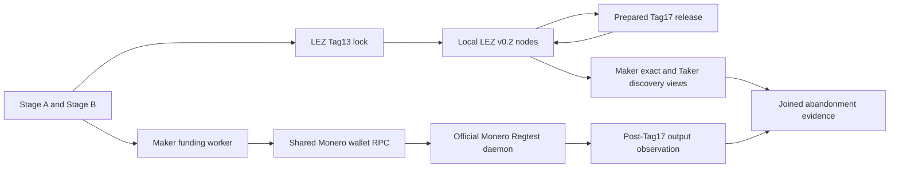
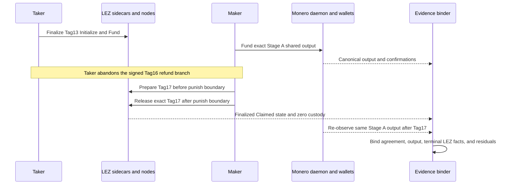

# ADR 0174: Join Tag17 to the funded Monero output

- Status: Accepted as an M7 progressive-PoC implementation checkpoint; exact
  pushed-commit actual-node replay pending
- Date: 2026-08-07

## Context

The existing Tag17 certificate proves the terminal LEZ punishment branch, but
its Monero stack supplies agreement identity only. Separate refund evidence
proves a real Monero recovery. Neither result alone demonstrates the cited
COMIT abandonment economics on one Stage-A agreement. RFP erratum GW-M4-003
also forbids describing the punishment fallback as literal both-leg refund.

## Decision

Add the opt-in `M7_XMR_JOINED_ABANDONMENT=1` protocol-only punish journey. It
does not change any default journey. The runner funds and canonically verifies
the exact Stage-A Monero output before Tag17, executes the existing prepared,
transaction-ID-bound Tag17 release after `punish_at`, requires byte-identical
Maker exact-owner and Taker discovery facts, and then re-observes the same
Monero transaction, agreement, destination, amount, and containing block.

The resulting packet states only that the fresh view-only wallet reports the
same output available after Tag17. It explicitly records that composite
key-image unspent authority is absent, literal both-refund is not claimed, and
the executed branch is the disclosed penalty model. Losing-branch injection,
future-reorg immunity, and application-supervisor composition remain later
hardening gates.

## Components and local RPCs

Every endpoint is a dynamically allocated literal-loopback origin. Monero runs
official 0.18.5.1 Regtest with zero peers and deterministic local funds; LEZ
uses the repository-pinned v0.2 stack and current checked guest. No public RPC,
faucet, peer, DNS dependency, public funds, or public deployment participates.

## Sequence and conditional atomicity

This is conditional economic safety, not a distributed transaction. If the
Taker withholds the Tag16 revelation, the Maker cannot reconstruct the shared
Monero spend key from this branch; after the later boundary the Maker instead
receives the terminal LEZ punishment disposition. The same fresh agreement and
two local ledgers prove that relationship. The output re-observation is useful
fresh-run evidence but is not independent unspent authority without composite
key images. Therefore the packet cannot satisfy literal F6 by relabeling the
penalty outcome as two refunds.

## Verification and limits

The fast contract is `./scripts/test-m4-actual-claim-poc-contract.sh`. The
commit-pinned actual replay is documented in manual Flow 1ZG. M7 F3/F6 remain
open until that replay is retained and the losing Tag14/Tag16 branches,
process-kill, concurrency, fee, and reorg cases are exercised. Independent
cryptographic review and GW-M4-003 disposition remain production gates.
