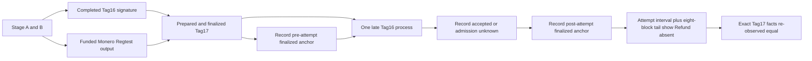
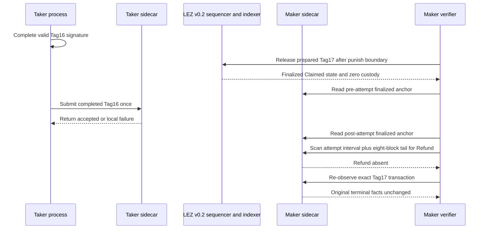

# ADR 0175: Exclude losing Tag16 after finalized Tag17

- Status: Implemented behind an isolated M7 hardening flag; two exact
  pushed-commit actual-node replays exposed staging and admission assumptions;
  a third was intentionally stopped before nodes after an oracle audit exposed
  false-absence and pseudo-anchor gaps; corrected replay pending
- Date: 2026-08-07

## Context

ADR 0174 proves one fresh agreement can bind an actual Monero output to the
terminal Tag17 penalty. That PoC does not itself try the mutually exclusive
Tag16 refund after Tag17 has finalized. F3/F6 require evidence that the losing
branch cannot replace or mutate the already terminal result.

## Decision

Add `M7_XMR_LOSING_TAG16_AFTER_TAG17=1`, which is valid only with the joined
abandonment mode. The runner completes the existing cryptographic Tag16 refund
signature before Tag17 preparation, proving the losing branch is not absent
merely because its witness was unavailable. After exact Tag17 finality it runs
the existing Tag16 process once with new request IDs and no retry.

Transport admission is not execution or finality. The hardening gate records
an exact successful sequencer `accepted` response, while any nonzero process
exit remains admission `unknown`; it does not infer rejection from a local
error, timeout, or crash. It never retries or treats admission as a successful
Refund. Authenticated `observe_finalized_clock` calls through the Maker sidecar
record full block identity, height, and timestamp immediately before and after
the attempt. The runner scans every block
after the start anchor through eight blocks after the second anchor for absence
of any effective matching Refund. Missing Refund is final only when the window
ends in exact `Claimed` metadata with zero custody; an included but statefully
rejected Refund is likewise absent only when those terminal facts hold at its
block and the window end. Finally it re-observes the exact Tag17 transaction,
compares canonical complete facts, and retains hashes of every raw observation.

## Components and RPC flow

The Taker Tag16 process calls its authenticated literal-loopback sidecar. Both
the losing-Refund scan and exact Tag17 re-observation call the Maker sidecar,
which reads the official local LEZ v0.2 indexer. The same official Monero
0.18.5.1 Regtest topology from ADR 0174 remains live, peerless, and local. No
public RPC, faucet, public funds, DNS dependency, or public deployment is used.

## Sequence and atomicity argument

The branch is atomic over the evidenced finalized window because the terminal
Tag17 state consumes custody before the late refund attempt, no matching Refund
finalizes in the full attempt interval or its eight-block finalized tail, and
the exact winning facts remain unchanged. A transport-admitted transaction is
not counted as a Refund effect, and a process failure is not called a chain
rejection. The anchors are actual authenticated finalized tips rather than
classification-window endpoints. This is stronger than testing a malformed
refund: the correct precommitted refund signature existed before Tag17. The
dynamic window removes any assumption about how many LEZ blocks elapse while
the Tag16 client exits.

It is not a distributed transaction and does not establish future-reorg
immunity, simultaneous pre-finality racing, process-kill recovery, or the
opposite ordering where Tag16 wins and late Tag17 loses. Those remain explicit
F3/F6 hardening slices.

## Verification

The fast runner contract is
`./scripts/test-m4-actual-claim-poc-contract.sh`. Manual Flow 1ZH documents
the exact-commit replay. A checked certificate may be retained only after
source status zero, the losing-branch packet passes, and exact cleanup
preserves the foreign sentinel.

The first exact-commit replay `m7lose16-a720b96-a` finalized Tag17 but failed
before the late Tag16 process because protocol-only losing mode had not staged
that binary. Exact cleanup passed. The focused RED/GREEN cycle corrected the
staging scope. The second replay `m7lose16-4c891e9-a` reached the late attempt;
LEZ admitted it and returned `accepted`, exposing the runner's incorrect
assumption that the CLI must reject synchronously. Exact cleanup passed. The
follow-up RED/GREEN cycle now judges only finalized exclusion and unchanged
Tag17 while retaining the admission outcome. A third exact-commit run,
`m7lose16-8b91756-a`, passed preflight and artifact checks but was stopped
during build, before provisioning any nodes: an independent source audit proved
that its scan compared the wrong start height, its classifier could not emit
final `Absent` for terminal Claimed state, and its post-attempt anchor was only
a one-block classification endpoint. RED/GREEN tests now bind the requested
start, make terminal Claimed/zero custody the exact exclusion rule, use actual
authenticated finalized-tip anchors, preserve `unknown` admission semantics,
and hash the full evidence packet. A fresh pushed-commit replay must still pass
the complete finalized window before this ADR can be accepted.
