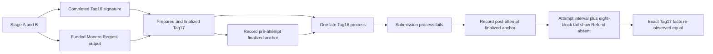
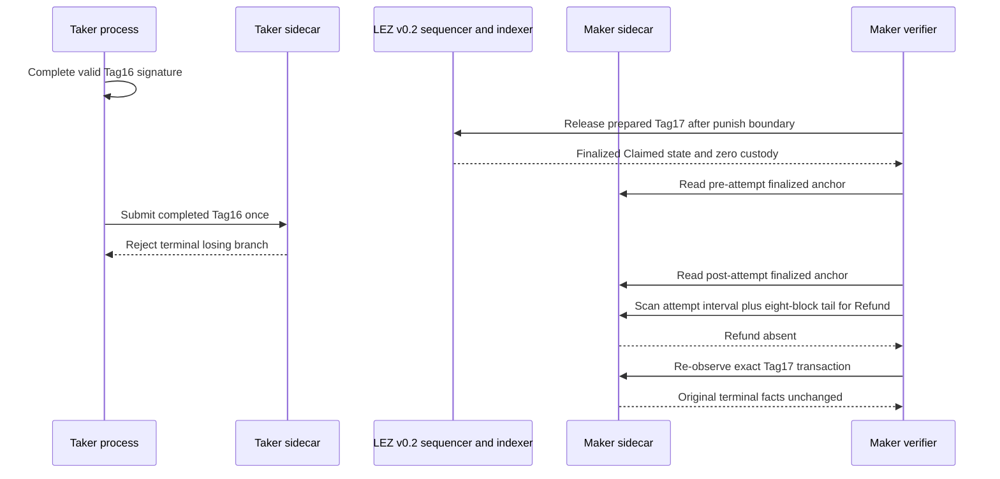

# ADR 0175: Reject losing Tag16 after finalized Tag17

- Status: Implemented behind an isolated M7 hardening flag; exact pushed-commit
  actual-node replay pending
- Date: 2026-08-07

## Context

ADR 0174 proves one fresh agreement can bind an actual Monero output to the
terminal Tag17 penalty. That PoC does not itself try the mutually exclusive
Tag16 refund after Tag17 has finalized. F3/F6 require evidence that the losing
branch cannot replace or mutate the already terminal result.

## Decision

Add `M7_XMR_LOSING_TAG16_AFTER_TAG17=1`, which is valid only with the joined
abandonment mode. The runner completes the existing cryptographic Tag16 refund
signature before Tag17 preparation, proving the losing branch is not absent
merely because its witness was unavailable. After exact Tag17 finality it runs
the existing Tag16 process once with new request IDs and no retry.

The hardening gate requires a nonzero Tag16 process exit and an empty
create-new evidence reservation. The latest finalized height observed before
that attempt is the start anchor. A second finalized anchor immediately after
the failed process closes the attempt interval; the runner scans every block
after the start anchor through eight blocks after the second anchor for absence
of any matching Refund. Finally it re-observes the exact Tag17 transaction and
compares the complete finalized facts with the pre-attempt Maker observation.

## Components and RPC flow

The Taker Tag16 process calls its authenticated literal-loopback sidecar. Both
the losing-Refund scan and exact Tag17 re-observation call the Maker sidecar,
which reads the official local LEZ v0.2 indexer. The same official Monero
0.18.5.1 Regtest topology from ADR 0174 remains live, peerless, and local. No
public RPC, faucet, public funds, DNS dependency, or public deployment is used.

## Sequence and atomicity argument

The branch is atomic over the evidenced finalized window because the terminal
Tag17 state consumes custody before the late refund attempt, the losing process
does not publish successful evidence, no matching Refund finalizes in the full
attempt interval or its eight-block finalized tail, and the exact winning facts
remain unchanged. This is stronger than testing a malformed refund: the correct
precommitted refund signature existed before Tag17. The dynamic window removes
any assumption about how many LEZ blocks elapse while the Tag16 client exits.

It is not a distributed transaction and does not establish future-reorg
immunity, simultaneous pre-finality racing, process-kill recovery, or the
opposite ordering where Tag16 wins and late Tag17 loses. Those remain explicit
F3/F6 hardening slices.

## Verification

The fast runner contract is
`./scripts/test-m4-actual-claim-poc-contract.sh`. Manual Flow 1ZH documents
the exact-commit replay. A checked certificate may be retained only after
source status zero, the losing-branch packet passes, and exact cleanup
preserves the foreign sentinel.
