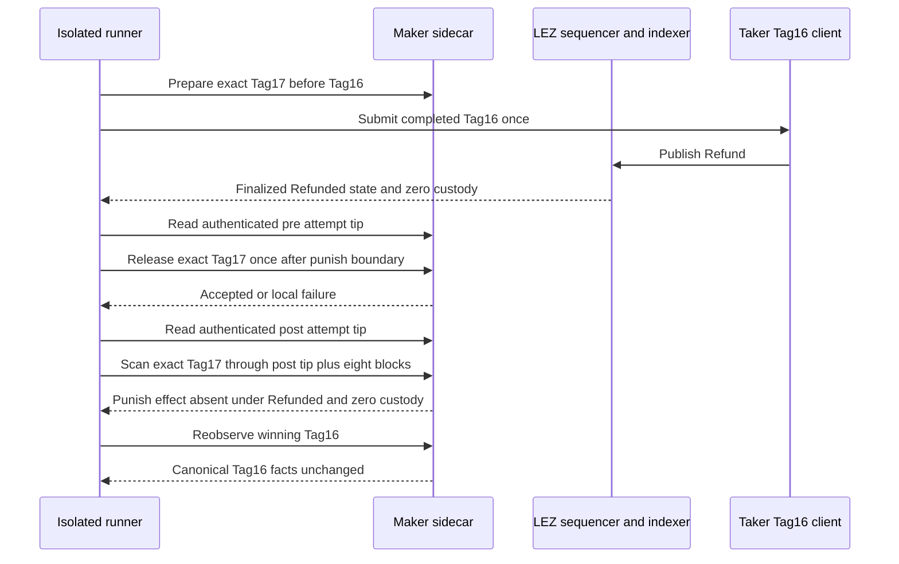

# ADR 0176: Exclude losing Tag17 after finalized Tag16

- Status: Accepted; focused RED/GREEN implementation complete, exact pushed-commit
  two-devnet replay pending
- Date: 2026-08-07

## Context

ADR 0175 proves the Tag17-wins ordering. Atomicity also needs the symmetric
ordering: a valid Tag17 must already be prepared, Tag16 must finalize first,
and a later punishment attempt must not replace the refunded terminal state.
Transport admission alone is not an execution or finality oracle.

## Decision

Add opt-in M7_XMR_LOSING_TAG17_AFTER_TAG16=1, restricted to the local
application refund journey and mutually exclusive with other M7 hardening
modes. The runner prepares exact claimant-signed Tag17 bytes before Tag16,
submits and finalizes Tag16, and binds the finality transaction ID to the
one-shot Tag16 submission. It then waits beyond punish_at, records the actual
authenticated finalized tip, releases the reserved Tag17 exactly once, records
admission as exact accepted or unknown, and records the next authenticated tip.

The Maker classifier scans the exact Tag17 target from the first block after
the pre-attempt anchor through eight finalized blocks after the post-attempt
anchor. Absent is conclusive only when authenticated metadata is Refunded and
custody is zero at an included candidate and at the window end, or at the
window end when the exact transaction is missing. Finally, the runner
re-observes Tag16 and requires canonical complete facts to remain byte-equal.

## Components and RPC flow

```mermaid
flowchart LR
    Agreement[Stage A and B] --> Tag17Ready[Prepared exact Tag17]
    Agreement --> Refund[One shot Tag16 submission]
    Tag17Ready --> Refund
    Refund --> Final16[Finalized Refunded and zero custody]
    Final16 --> Pre[Authenticated pre attempt tip]
    Pre --> Late17[One late Tag17 release]
    Late17 --> Admission[Accepted or admission unknown]
    Admission --> Post[Authenticated post attempt tip]
    Post --> Scan[Exact Tag17 scan plus eight block tail]
    Scan --> Reobserve[Canonical Tag16 facts unchanged]
    MakerSidecar[Maker sidecar] --> LocalIndexer[Official local LEZ indexer]
    Late17 --> MakerSidecar
    Scan --> MakerSidecar
```

All LEZ sequencer, indexer, and sidecar RPCs use dynamically allocated literal
loopback endpoints. The joined Monero 0.18.5.1 Regtest daemon and wallet RPCs
remain isolated and peerless. Funds come only from deterministic local
genesis/Regtest outputs. No public RPC, faucet, DNS dependency, public funds,
or public deployment is used.

## Sequence and atomicity argument

The evidenced interval is atomic because the winning Refund consumes custody
before the late attempt; the exact prebuilt Punish has no effective finalized
transition anywhere in the complete attempt interval or eight-block tail; and
the winning transaction, state, and zero balance remain identical afterward.
An accepted transport response is never counted as a Punish effect, while a
nonzero process exit proves only unknown admission. This is bounded finalized
evidence, not a distributed transaction, future-reorg immunity, or proof of all
simultaneous pre-finality schedules.

## Verification

The focused classifier test is
tag_14_through_tag_17_are_classified_by_owner_and_counterparty; it was RED
before terminal Refunded could exclude Punish and is now GREEN. The runner
contract is ./scripts/test-m4-actual-claim-poc-contract.sh. Manual Flow 1ZI
documents exact-commit reproduction. No certificate or milestone tag may be
created until a fresh pushed-commit replay, evidence validation, exact cleanup,
and foreign-sentinel preservation all pass.
