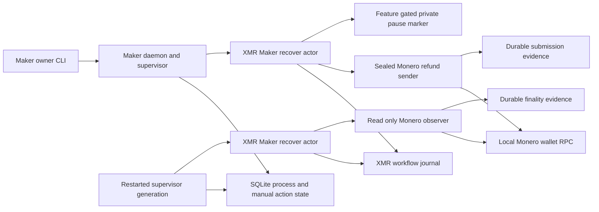
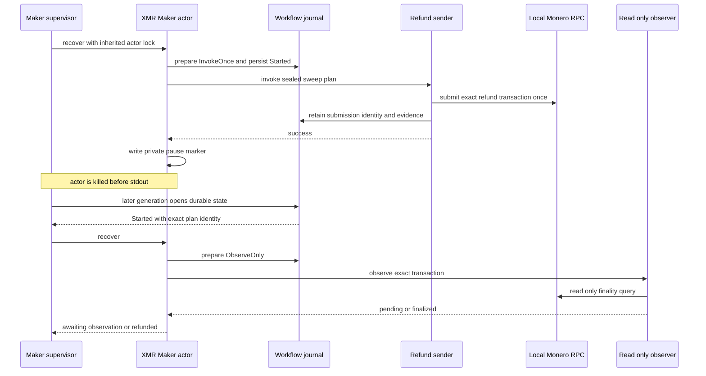

# ADR 0177: Reconcile killed Monero refund actors

- Status: Accepted; real-actor component and joined runner contracts GREEN,
  exact pushed-commit actual-node replay pending
- Date: 2026-08-07

## Context

ADR 0166 persists one Monero refund submission before the sender exits and ADR
0167 gives the observer no spend authority. A crash after the sender succeeds
but before the Maker actor returns stdout is therefore the critical ambiguity:
blind retry could spend twice, while treating missing stdout as failure could
strand a recoverable swap.

## Decision

Extend the existing compile-time-only submitted-effect pause seam to the exact
Maker operation `sweep_monero_refund`. The supervisor injects the hook only
for the selected swap and the XMR `recover` command. The role actor may write
the private no-clobber marker only after the sealed sender exits successfully
and before actor stdout. Production builds contain neither the daemon flags nor
the pause configuration.

After a killed actor, durable workflow state remains `Started`. The next
generation must select `ObserveOnly`; it may complete from exact finalized
evidence but cannot invoke the sender again. A joined actual-node phase will
also kill the daemon, prove abandoned-generation transfer, preserve the
submission inode and digest, and mine confirmations only after restart. The
joined runner kills the daemon group first so it cannot resolve the attempt,
then kills the separately grouped paused actor; only after both exact
PID/start-tick/executable identities disappear may a fresh daemon reopen the
same database and registry.

The crash trigger is the conjunction of durable submission evidence, a leased
manual Refund generation, and the authenticated post-send marker. It must not
also require the daemon's revision-one projection: the actor emits that
projection on stdout, and this fault deliberately pauses before stdout. The
normal no-crash supervisor retains the stricter revision-one requirement.

## Components

## Crash and recovery flow

## Atomicity argument and limits

The workflow transaction chooses `InvokeOnce` before process creation. Once
the sender succeeds, the same workflow identity can produce only
`ObserveOnly` or `Complete`; it cannot return to `InvokeOnce`. The fault
marker is written after sender success and before stdout, so killing at the
marker exercises the ambiguous response boundary. The real-actor test proves
the exact effect log is `invoke\nobserve\n`, never two invokes.

The component checkpoint proves process and durable-workflow behavior with the
real role actor but fixture sender/observer processes. The joined runner now
implements full-daemon and actor kills, abandoned generation transfer, and
actual Monero submission-identity preservation; those claims remain pending
until an exact clean pushed-commit replay passes. Reorg safety, fee pressure,
and concurrent accepted swaps remain separate gates.

The first exact replay reached one accepted Tag16 refund and one durable Monero
refund submission, then exposed an ordering error in the harness: it waited
for the impossible pre-stdout revision-one projection, so the supervisor's
120-second attempt timeout requeued the paused actor before the ordered kill.
The RED/GREEN predicate fixture now proves crash mode accepts the leased
revision-zero pre-stdout state while normal mode rejects it. The interrupted
run cleaned only its exact resources and is diagnostic evidence, not a
certificate.

The corrected pushed-commit replay then reached the ordered daemon and actor
SIGKILL boundary. The actor executable identity disappeared, but an immediate
process-group query still observed a non-zombie member during exit and failed
the run. The crash path now waits a bounded 200 times at 50 milliseconds for
that exact actor group to quiesce, using the existing helper that ignores only
zombies; any live member after ten seconds still fails closed. This second run
is also diagnostic rather than certificate evidence.

## Verification

The RED/GREEN boundaries are the exact Monero-recover crash-hook test in
`zec-reference-actor/tests/crash_hook.rs`, supervisor operation admission in
`daemon_actor_supervisor_cli.rs`, and
`killed_refund_actor_reconciles_durable_submission_without_resend` in
`maker_xmr_tag17_supervisor.rs`. The feature-gated real-actor test sends
`SIGKILL` to the exact actor process group and reaches terminal completion
through one observation.

The joined runner and its static RED/GREEN contract are
`run-m4-actual-claim-poc.sh` and
`test-m4-actual-claim-poc-contract.sh`. Manual Flow 1ZJ gives the exact
two-devnet command and expected process evidence.
