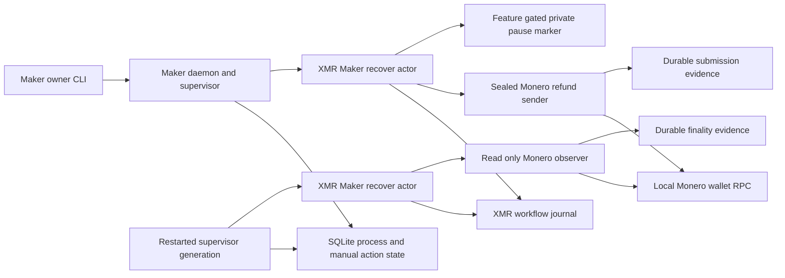
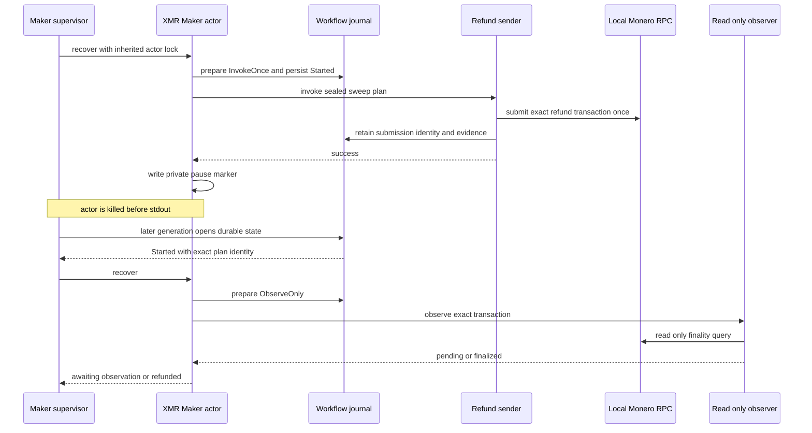

# ADR 0177: Reconcile killed Monero refund actors

- Status: Accepted; real-actor component GREEN, joined actual-node restart pending
- Date: 2026-08-07

## Context

ADR 0166 persists one Monero refund submission before the sender exits and ADR
0167 gives the observer no spend authority. A crash after the sender succeeds
but before the Maker actor returns stdout is therefore the critical ambiguity:
blind retry could spend twice, while treating missing stdout as failure could
strand a recoverable swap.

## Decision

Extend the existing compile-time-only submitted-effect pause seam to the exact
Maker operation `sweep_monero_refund`. The supervisor injects the hook only
for the selected swap and the XMR `recover` command. The role actor may write
the private no-clobber marker only after the sealed sender exits successfully
and before actor stdout. Production builds contain neither the daemon flags nor
the pause configuration.

After a killed actor, durable workflow state remains `Started`. The next
generation must select `ObserveOnly`; it may complete from exact finalized
evidence but cannot invoke the sender again. A joined actual-node phase will
also kill the daemon, prove abandoned-generation transfer, preserve the
submission inode and digest, and mine confirmations only after restart.

## Components

## Crash and recovery flow

## Atomicity argument and limits

The workflow transaction chooses `InvokeOnce` before process creation. Once
the sender succeeds, the same workflow identity can produce only
`ObserveOnly` or `Complete`; it cannot return to `InvokeOnce`. The fault
marker is written after sender success and before stdout, so killing at the
marker exercises the ambiguous response boundary. The real-actor test proves
the exact effect log is `invoke\nobserve\n`, never two invokes.

This checkpoint proves process and durable-workflow behavior with the real
role actor but fixture sender/observer processes. It does not yet claim a
killed full daemon, actual Monero transaction preservation, reorg safety, fee
pressure, or concurrent accepted swaps. Those remain explicit joined
actual-node gates.

## Verification

The RED/GREEN boundaries are the exact Monero-recover crash-hook test in
`zec-reference-actor/tests/crash_hook.rs`, supervisor operation admission in
`daemon_actor_supervisor_cli.rs`, and
`killed_refund_actor_reconciles_durable_submission_without_resend` in
`maker_xmr_tag17_supervisor.rs`. The feature-gated real-actor test sends
`SIGKILL` to the exact actor process group and reaches terminal completion
through one observation.
