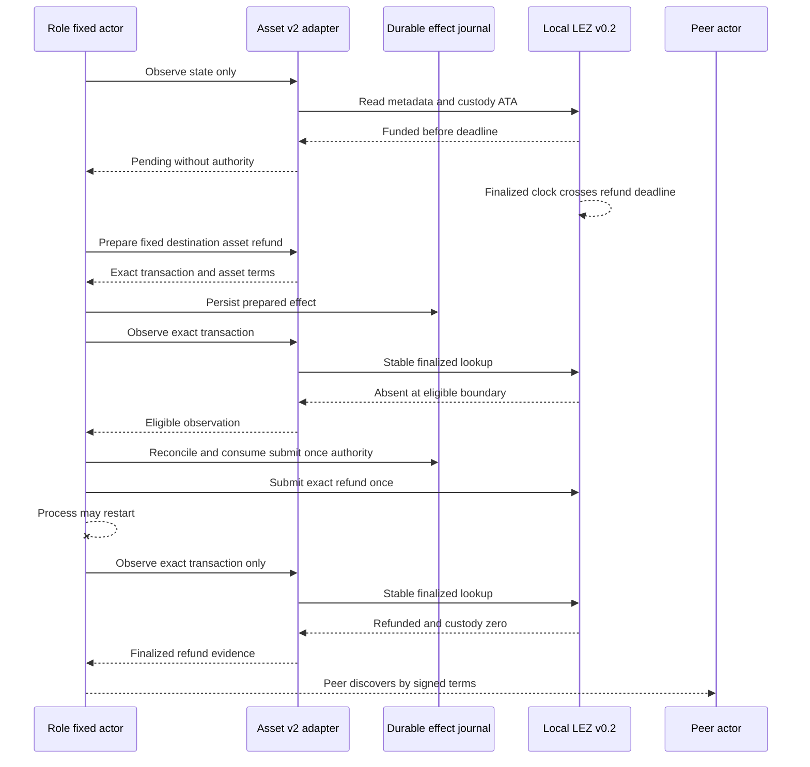

# ADR 0178: Route custom-token refunds through the asset v2 bridge

Status: accepted; component GREEN, actual-node replay pending

## Context

The F7 claim route already uses the countersigned schema-5 asset extension and
the witnessed-asset v2 bridge. Timeout recovery still selected the native v1
refund messages, which cannot represent Token and ATA accounts. The protocol,
client, and policy adapter already expose fixed-destination asset refund
preparation and observation, so another wire or dependency would duplicate a
reviewed boundary.

## Decision

Schema-5 recovery constructs the same `BtcLezAssetBridgeBindingV2` used by the
claim route. Preparation and observation go through the existing v2 adapter;
only an exact transaction authorized by the existing durable public-effect
journal reaches generic submission. Every deterministic request identity binds
the base agreement, asset commitment, transition, role, runtime, full terms,
target, and, for submission, exact transaction. Schema-4 native recovery stays
on v1.

## Atomicity argument and limits

The LEZ refund is one on-chain transition that returns the exact 75-token
custody balance to the signed depositor and makes custody zero. The opposite
Bitcoin refund remains separately deadline-gated. The actor advances only from
canonical evidence, and accepted/started journal states cannot rearm a second
send after restart. Thus the conditional two-refund path returns both
principals without a cooperative claim effect; it is not a distributed
transaction and does not claim immunity to future reorganization, fee stress,
or every crash boundary.

The checked component contract covers both role/direction shapes and distinct
asset definitions. Exact local-node execution, terminal balances, replay, and
scoped cleanup remain the certificate gate.
