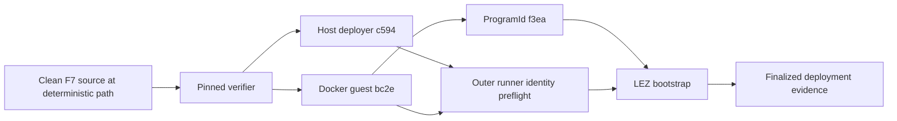

# ADR 0179: Pin the verified F7 host deployer build

Status: accepted

## Context

The F7 witnessed-token guest is reproducible in the digest-pinned Risc0 Docker
builder. Rebuilding the unchanged host deployer from the same clean source and
Rust 1.96 toolchain in a different absolute Git worktree produced different
debug bytes because the executable retains absolute source-path metadata. The
guest SHA-256 and derived ProgramId remained byte-for-byte unchanged.

The previous retained artifact had been reclaimed during approved disk
cleanup. Weakening the early and point-of-use deployer identity checks would
turn a local path issue into a real executable-substitution risk.

## Decision

Use clean source commit `0b54ab68f766ff016741dd6ba2eacade4a1c1e31` at the
deterministic worktree path `/tmp/lez-f7-artifact-src-0b54ab68`, run the full
pinned verifier, and pin its host deployer SHA-256
`c594ea1ec34fc0227e8e1b6ced9917ad4df5c5e4dfac7616565aae830d3f5cbd`.
Keep the Docker guest SHA-256
`bc2ea18eaacb917727934fcf0366dd54c1f9a2b69b61ea53080c926850967fd7`
and ProgramId
`f3ead24b95d316ce91980cb3531a70b83a27fd1640f47c1b857757aef26c244e`
unchanged. The outer runner validates both files before prebuild, and the LEZ
bootstrap revalidates them through deployment and evidence publication.

## Security and atomicity consequences

This rotates a host executable identity, not an on-chain program or protocol
identity. The fully checked source, guest, ProgramId, IDL, recursive token
refund tests, and submit-once deployment behavior are unchanged. Exact file
hashes remain fail-closed before any node or chain effect, so a substituted
deployer cannot enter the swap flow. The swap's conditional atomicity argument
is unaffected: the asset-v2 terminal refund remains one aggregate LEZ
transaction, while the cross-chain refund ordering and timelock assumptions
remain those documented by ADR 0178.

The host deployer is path-reproducible only under the recorded worktree recipe;
it is not claimed to be a path-independent reproducible build. A future release
should produce a stripped or remapped release artifact in a digest-pinned
builder and rotate the pin only after equivalent full verification.
