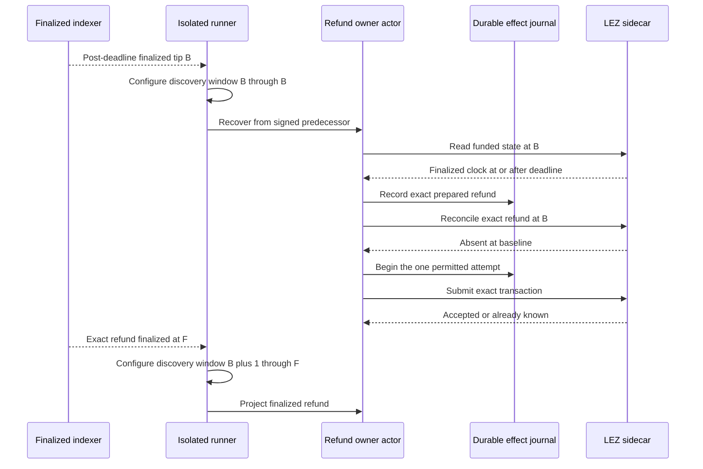

# ADR 0180: Refresh the LEZ refund observation window

Status: accepted

## Context

The actor's finalized discovery window is intentionally bounded. During a
two-lock refund journey, however, the window used to prove the Maker lock can
end before the signed LEZ refund deadline. Reusing that old window makes the
refund observer read a valid but pre-deadline clock. It then fails closed with
`actor chain observation is unavailable`; retrying the same immutable window
cannot make progress and repeatedly performs an expensive historical scan.

## Decision

Immediately after the runner observes the post-deadline finalized tip, record
that tip as `refund_start` and rewrite both role configs to a one-block window
at that exact finalized baseline before invoking the refund owner. The owner
still prepares the exact signed refund, records its bytes in the durable
submit-once journal, reconciles the baseline, and only then may submit once.
After exact finality, replace the baseline with the complete bounded window
from `refund_start + 1` through the proved containing tip before either role
projects the refund.

## Security and atomicity consequences

The refresh does not widen signing or submission authority. The baseline is
read from the finalized indexer only after the signed guest deadline, and the
checked guest remains the definitive deadline enforcer. A one-block baseline
is sufficient before the first attempt because the exact prepared refund has
not yet entered the actor's one-attempt journal and cannot have been accepted
before its deadline. Concurrent publication after the baseline is harmless:
the transaction bytes and ID are identical, while the durable journal prevents
a second actor attempt.

Projection remains stricter than submission. Neither role advances until the
runner proves the exact transaction in a finalized block, reconstructs the
complete post-baseline window, and the actor verifies refunded metadata, zero
custody, and immutable depositor facts. Thus the correction restores liveness
without weakening conditional atomicity or turning uncertain observation into
authority.
