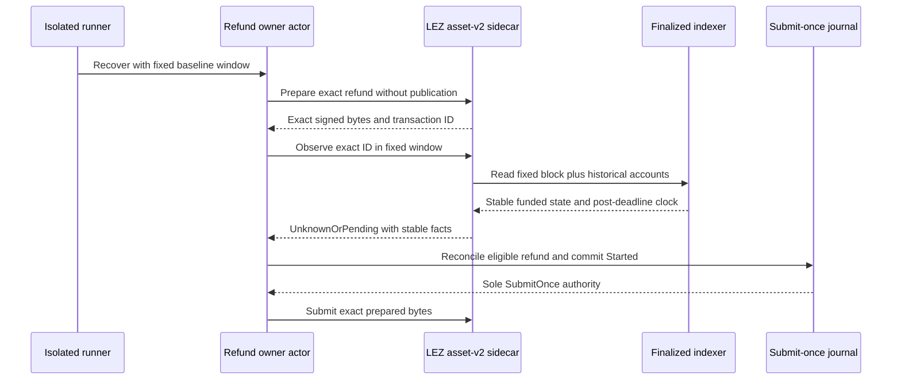

# ADR 0181: Preserve uncertainty for an exact refund miss

Status: accepted; actual-node GREEN on m7f7refund-062b6ba-h

## Context

The asset-v2 sidecar used one result for two different claims. A complete
terms-discovery scan can prove no matching refund exists in its bounded
window, but failing to find one caller-supplied transaction ID cannot exclude
a different permissionless refund outside that target. The sidecar returned
`Absent` for both cases. The bridge client and actor deliberately rejected
`Exact + Absent`, so a valid post-deadline refund remained fail-closed without
ever reaching the durable submission CAS.

The owner also read account state at the continually advancing latest
finalized tip before using its caller-pinned exact window. On the local LEZ
0.2 stack, finalized block identity can advance ahead of historical account
snapshot availability. Repeated owner invocations could therefore chase an
unavailable newest snapshot even though the fixed baseline was complete.

## Decision

Return `UnknownOrPending` when an exact-ID scan finds no matching refund;
reserve `Absent` for a completely covered `DiscoverByTerms` scan. The exact
result still carries one stable finalized clock plus metadata and custody
facts. For the refund owner, prepare the non-public exact transaction first
and use only that caller-pinned exact response for state, deadline, and
reconciliation. Non-owners retain terms discovery and never prepare or submit.

## Security and atomicity consequences

`UnknownOrPending` does not authorize by itself. The actor additionally
requires exact agreement/asset/runtime echoes, funded metadata, full custody,
an immutable depositor, and a fixed finalized timestamp at or after the signed
refund deadline. The journal then atomically changes `Prepared` to `Started`
before the sole send; uncertainty after that point can only be observed and
can never rearm submission.

Preparation creates no public effect, and the checked guest remains the final
deadline enforcer. Removing the moving-latest owner read therefore removes a
liveness dependency without weakening chain truth. A non-owner still uses a
complete terms scan to discover the permissionless terminal effect, so both
roles project only finalized exact facts. Exact pushed-source run
m7f7refund-062b6ba-h crossed this boundary twice: each owner obtained one
submit-once authority from the fixed baseline, while each peer discovered and
projected only the finalized exact refund.
