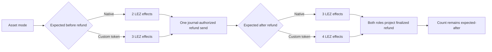

# ADR 0182: Preserve asset-aware refund effect counts after projection

Status: accepted; component GREEN, fresh actual-node replay pending

## Context

The refund runner correctly derives three durable LEZ submissions for native
value and four for a witnessed custom token. It used that distinction before
and immediately after the refund send, but the post-finality projection guard
still required the native literal `3`. A valid custom-token refund therefore
finalized and projected to both role stores, then the runner failed closed
before the opposite Bitcoin refund despite retaining exactly the expected four
effects.

## Decision

Use the already-derived `expected_after` value for the final projection guard.
Projection remains read-only: the same count checked after the one permitted
refund send must remain unchanged after Maker and Taker consume finalized
evidence. A source-contract regression rejects any return to the native
literal.

## Security and atomicity consequences

The change grants no submission authority and does not weaken finality. The
refund owner still obtains one send only after the signed deadline and durable
journal transition; both roles still project only the exact finalized refund.
The corrected final guard now proves projection added no effect for either
asset mode instead of rejecting the valid custom-token count. Exact run
`m7f7refund-d8515ea-e` is bounded RED evidence: both roles reached revision
three after one finalized LEZ refund, the stale literal rejected count four,
and exact cleanup targeted no foreign resource. It is not a completed swap or
certificate.
