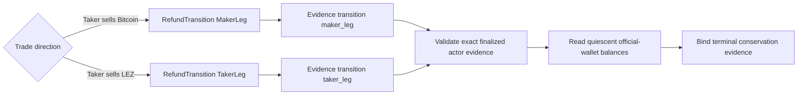

# ADR 0183: Use canonical refund transition evidence names

Status: accepted; component GREEN, fresh actual-node replay pending

## Context

The actor stores finalized refund evidence under the serialized
`RefundTransition` variants `maker_leg` and `taker_leg`. The custom-token
terminal-balance wrapper selected the lifecycle labels `maker_refund` and
`taker_refund` instead. A complete first-direction run therefore reached
revision four in both role stores with two Bitcoin and four LEZ effects and
zero replay resubmission, but failed closed before balance sampling because its
otherwise exact finalized actor evidence used the canonical enum vocabulary.

## Decision

Map the forward Maker refund to `maker_leg` and the reverse Taker refund to
`taker_leg`. Keep the evidence-kind lookup, actor revision, role, asset
commitment, token definition, ATA identities, zero custody, transaction ID,
and containing finalized block checks unchanged. A source-contract regression
requires both canonical values and rejects the two noncanonical aliases.

## Security and atomicity consequences

This changes no protocol message, signer, journal, transaction, deadline, or
chain effect. It makes the terminal evidence wrapper consume the actor's
canonical durable vocabulary and retains every substantive exact-evidence
predicate. Exact run `m7f7refund-f279734-f` is bounded RED evidence: both
refunds in the forward direction finalized in their signed order, both actors
reached revision four, terminal replay added no effect, the stale alias alone
rejected the actor packet, and exact cleanup targeted no foreign resource. It
is not a two-direction certificate.
