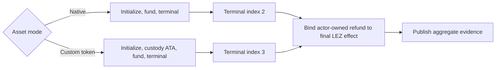

# ADR 0184: Index terminal effects by asset shape

Status: accepted; component GREEN, fresh actual-node replay pending

## Context

The aggregate evidence publisher validates that each actor-owned terminal
transaction is the final effect for its chain. Native LEZ swaps have three
effects, so their terminal claim or refund is index two. Witnessed custom-token
swaps add custody-ATA creation and have four effects, placing the terminal
effect at index three. The claim branch already selected the index from the
asset mode; the refund branch retained the native literal.

Exact run `m7f7refund-2eb2f9c-g` completed both ordered refund directions,
reached revision four in all four role stores, sampled the expected terminal
token balances, and replayed without another submission. Final publication
then failed closed because it compared the actor-owned LEZ refund with the
custom-token funding effect at index two. Exact cleanup removed only run-owned
resources.

## Decision

Select the LEZ terminal-effect index from the asset shape for both claim and
refund journeys: index two for native value and index three for a witnessed
custom token. Keep every effect-count, uniqueness, role ownership, cooperative
claim absence, and cross-direction disjointness check unchanged.

## Security and atomicity consequences

The decision changes no signer, transaction, submission authority, deadline,
or chain observation. It prevents the publisher from confusing a custom-token
funding effect with its later finalized refund while preserving the exact
four-effect count and unique-ID requirements. A focused fixture now constructs
both complete custom-token refund manifests and fails if the native asset mode
accepts them.

Run `m7f7refund-2eb2f9c-g` is bounded RED evidence, not a certificate. It
proves both economic refund directions through terminal state but cannot be
used as milestone evidence because the aggregate publisher exited nonzero.
