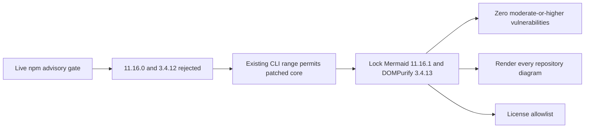

# ADR 0185: Resolve the patched Mermaid core inside the pinned CLI

Status: accepted; vulnerability and license gates GREEN

## Context

The repository pins Mermaid CLI 11.16.0 for reproducible documentation checks.
On 2026-08-08, the live advisory database reported moderate vulnerabilities in
the resolved Mermaid 11.16.0 and DOMPurify 3.4.12 packages. The CLI already
declares Mermaid `^11.14.0`, so patched core 11.16.1 and DOMPurify 3.4.13 fit
the existing supported dependency range without replacing the CLI.

## Decision

Keep the exact CLI and Puppeteer pins, but refresh the lockfile to resolve
Mermaid 11.16.1 and DOMPurify 3.4.13. Continue to require the conservative
GitHub syntax contract, a complete render pass, `npm audit` at moderate
severity, and the Node license allowlist.

## Consequences

The change alters documentation tooling only; it changes no swap protocol,
runtime component, signer, RPC, or chain effect. Mermaid remains MIT and
DOMPurify remains `(MPL-2.0 OR Apache-2.0)`, both already accepted by policy.
Cold installation still depends on npm registry availability, while runtime
swap certification does not depend on this tooling or any external network.
