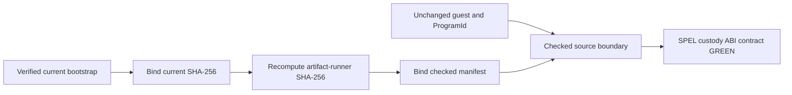

# ADR 0186: Rebind the checked artifact to the current bootstrap boundary

Status: accepted; executable source-boundary and SPEL ABI gates GREEN

## Context

The checked M4 LEZ artifact runner fail-closes if any bound source changes.
Later M7 work intentionally changed `run-m3-lez-bootstrap.sh` to pin the fully
verified F7 host deployer while keeping the guest ELF and ProgramId unchanged.
The retained M4 manifest still named the older bootstrap digest, so the full
quality wrapper correctly rejected the source boundary before running the M7
SPEL custody-ABI contract.

## Decision

Bind the artifact runner and checked manifest to the current bootstrap digest
`9ef12e...88ce6a8`, then bind the manifest to the resulting runner digest
`5a9371...89a94`. Preserve every guest, methods, recursive-test, ELF, image-ID,
SPEL commit, generated-IDL, and generated-client digest unchanged.

## Security and deployment consequences

This does not rebuild, redeploy, or change the on-chain guest. It closes the
gap in which a valid later host bootstrap made the old checked boundary
non-executable, while retaining fail-closed hashing at every point of use.
Actual-node run `m7f7refund-062b6ba-h` proves the current bootstrap/deployer
combination; the source-boundary verifier and SPEL contract prove the local
composition. Public deployment remains a separate configuration and operator
activity.
