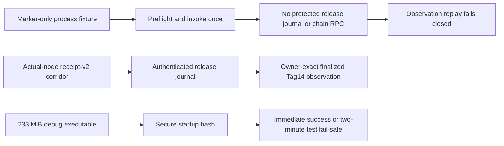

# ADR 0187: Keep Tag14 process doubles honest under shared load

Status: accepted; focused XMR process journeys GREEN

## Context

Exact Tag14 observation now authenticates the current protected release-journal
transaction before disclosing its public bytes to the finalized classifier.
The older application-process fixture used a marker-only sender, created no
release journal and exposed no chain RPC, but still expected its marker-only
classifier to fabricate a completed Tag14 result. The full Rust gate correctly
rejected that stale model. The same gate also measured that hashing the
fixture's 233 MiB single-link debug executable can exceed its old 30-second
readiness ceiling when unrelated shared-host workloads are active.

## Decision

Keep the marker fixture as an invocation proof only. It must preflight and
invoke exactly once, then every observation-only replay must fail closed
without another invocation or any fabricated observer output. Retain semantic
Tag14 completion in the actual-node `m7claim-2cff48d-a` evidence instead.

Raise only this test's readiness fail-safe from 30 seconds to two minutes.
Successful startup returns immediately, daemon early exit still fails
immediately, and no production timeout or runtime behavior changes.

## Security and iteration consequences

The process test can no longer turn a marker into false chain-finality
evidence. Exactly-once invocation, branch exclusion, lock custody, tamper
rejection and artifact identity checks remain. The larger ceiling removes a
shared-load false negative without slowing successful runs or relaxing any
file, signer, journal, RPC or observation validation.
