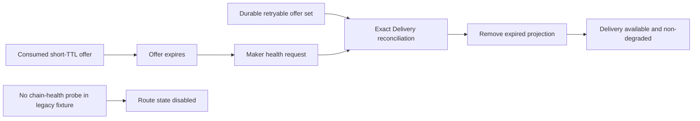

# ADR 0188: Expect expired Delivery reconciliation in ZEC process tests

Status: accepted; focused ZEC process journey GREEN

## Context

The legacy ZEC Chat process test deliberately lets its short-lived consumed
offer expire before sampling Maker health. Its July assertion expected the
expired Delivery envelope to remain as projection drift, making Delivery
unavailable and health degraded. M7 route-health reconciliation now reconciles
Delivery from durable retryable offers during that health request and removes
the expired envelope. The stale test failed while the safer implementation
reported healthy Delivery and no projection drift.

## Decision

Assert the current post-expiry contract: Maker remains ready and non-degraded,
Delivery and Chat are available, the expired projection is absent, and the
route dependency is explicitly `disabled` because this legacy process fixture
does not configure a chain-health probe.

## Consequences

No daemon, store, chain, RPC, signer or production timeout changes. The test
stops treating successful stale-file cleanup as an outage and now verifies the
absence of the expired envelope. Dedicated M7 route-health tests continue to
cover configured available/unavailable probes and route-scoped withdrawal.
