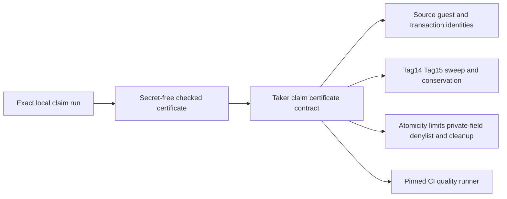
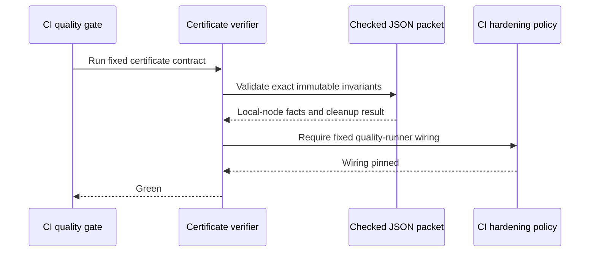

# ADR 0189: Pin the actual Taker claim certificate in CI

Status: accepted; certificate and CI contracts GREEN

## Context

Exact pushed-commit run `m7claim-2cff48d-a` already joined the receipt-v2
Taker command to semantic Tag14 publication, finalized owner-exact observation,
the later Maker Tag15 claim, adaptor extraction, and the Taker Monero sweep.
Its secret-free certificate was checked into the repository, but no executable
contract validated that packet or required CI to keep validating it. As a
result, the hard-requirement and traceability text continued to describe the
semantic claim and sweep as unfinished even though the actual-node run passed.

## Decision

Validate the immutable certificate with a dedicated fail-closed shell contract
and invoke that contract from the pinned quality runner. The verifier binds the
exact run and source commit, guest identities, role-correct Tag14 and Tag15
observations, bounded scan and finalized clocks, Monero Regtest identity and
ten-confirmation sweep, exact amount conservation, conservative atomicity
claims, absence of public dependencies, exact cleanup, and a private-field
denylist.

## Atomicity and evidence scope

The certificate proves conditional successful-claim atomicity: finalized
Tag14 releases only the precommitted Taker claim partial; finalized Tag15 then
exposes the adaptor information needed for the Taker to reconstruct and sweep
the already funded Monero output. Exact fee conservation and the role-correct
wallet receipt are bound by the retained packet. This is not a distributed
cross-chain transaction, future-reorganization immunity, public-network proof,
or evidence for adverse concurrency and process-crash schedules.

## Consequences

The actual-node semantic Taker claim and Monero sweep are now continuously
checked rather than supported only by narrative. F9 and U4 remain open for
their other daemon-owned lifecycle, abandonment, concurrency, and crash cases;
no M7 row changes to GREEN solely because this evidence gap closes.
