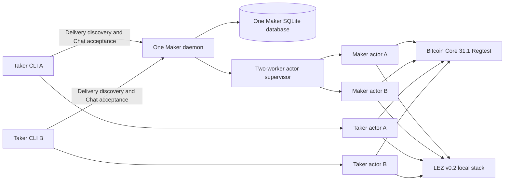
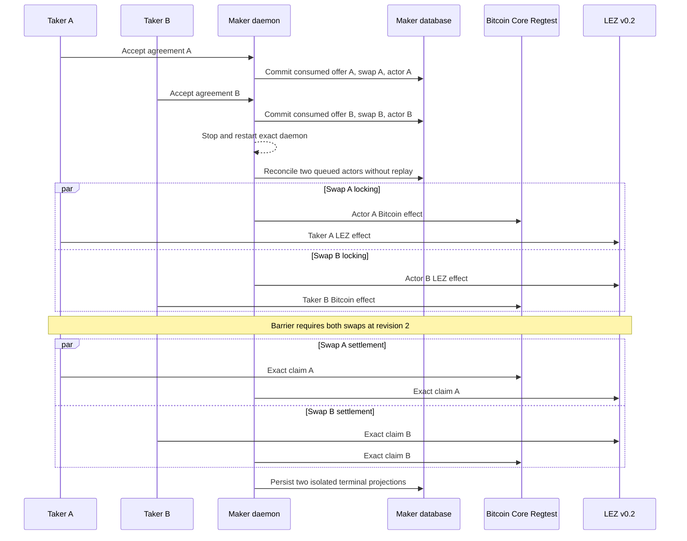

# ADR 0190: Compose accepted BTC overlap under one daemon

Status: Accepted for implementation; contract and shared Maker identity GREEN,
actual-node execution pending

## Context

M3 already proves two opposite-direction BTC swaps overlapping on one isolated
Bitcoin Core Regtest node and one isolated LEZ v0.2 stack. It keeps agreements,
escrows, deadlines, actor stores, signing journals, and funding outpoints
distinct, then withholds settlement until both swaps are durably locked.

M5 separately proves real Delivery and Chat admission into daemon-provisioned
role actors. Its existing BTC runner intentionally admits one application
through one daemon and database. M7 U2 and submission row S5 still require the
composition: two accepted applications, one long-running Maker boundary, and
overlapping actual-chain effects with restart isolation.

The production daemon already accepts a bounded registry of as many as 256
startup-pinned BTC Maker authority templates and selects the exact template by
the authenticated swap ID. The missing capability is therefore runner
composition, not another scheduler or authority registry.

## Decision

Add an opt-in `M7_BTC_ACCEPTED_CONCURRENCY=1` mode over the current M3/M5
runner. It is fixed to native BTC, the claim journey, and the existing
opposite-direction overlap schedule. The mode must:

1. create two authenticated application plans with distinct swap identities;
2. load both exact Maker authority templates into one daemon;
3. accept both applications into one database and one Delivery/Chat boundary;
4. restart that daemon once before activation and prove no acceptance or actor
   registration replay;
5. run two bounded supervisor workers; and
6. retain the existing revision-two barrier so neither settlement begins until
   both independent swaps have actual locks.

The default M3 overlap and single-application M5 BTC paths remain unchanged.
The new contract is continuously checked, but this ADR does not mark U2 or S5
GREEN until a clean pushed exact-node certificate validates the execution.

The stage-one provisioner now accepts one explicitly pinned owner-private Maker
signing key. It reads that key through the existing stable O_NOFOLLOW,
single-link, mode-0600 boundary, writes a distinct-inode output copy, and
generates every Taker, refund, claim, and adaptor secret freshly while rejecting
collisions. Tests check both the library and literal CLI paths and ensure the
secret or its hexadecimal form never enters stdout.

The Delivery planner now retains its one-direction M5 default while the M7
mode configures both fixed direction routes through one daemon and database.
It requires the same public Maker identity, then produces two distinct signed
offer commitments, reservation IDs, and authenticated swap IDs. This source
composition and its legacy regressions are GREEN; the claims remain pending an
exact-node execution certificate.

## Components

## Acceptance and overlap flow

## Atomicity argument

The two swaps are not one transaction and are not atomic with each other. Each
swap remains conditionally atomic because its own adaptor secret is unusable
for settlement until both of that swap's locks are confirmed, and either the
claim path completes both legs or the independently signed timeout branches
recover them. The overlap barrier strengthens the test: no settlement secret
is released while either agreement is only singly funded. Distinct swap IDs,
agreements, outpoints, LEZ accounts, deadlines, state databases, and signing
journals prevent one swap's progress or restart reconciliation from
authorizing the other.

## Consequences

- The implementation reuses the audited daemon registry, supervisor, Chat
  acceptance, and M3 overlap controller.
- The test contacts no public RPC, peer, faucet, or public funds; its endpoints
  are run-owned literal-loopback services and its funds are deterministic
  local Regtest/genesis outputs.
- Loopback proves the real pinned node binaries and consensus/effect paths in
  an isolated topology. It does not prove public-provider reliability,
  production key custody, fee-market behavior, or future-reorg immunity.
