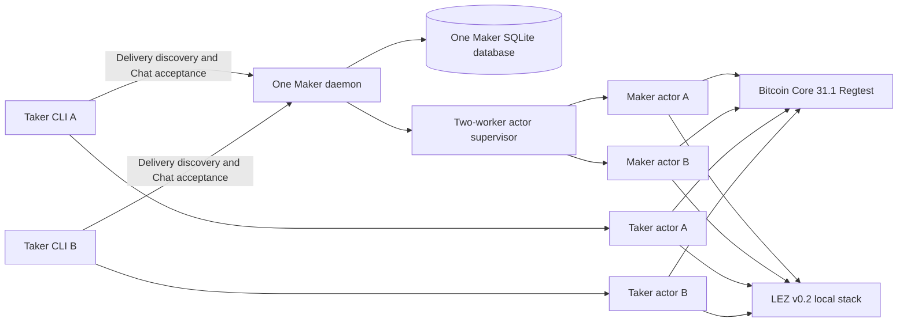
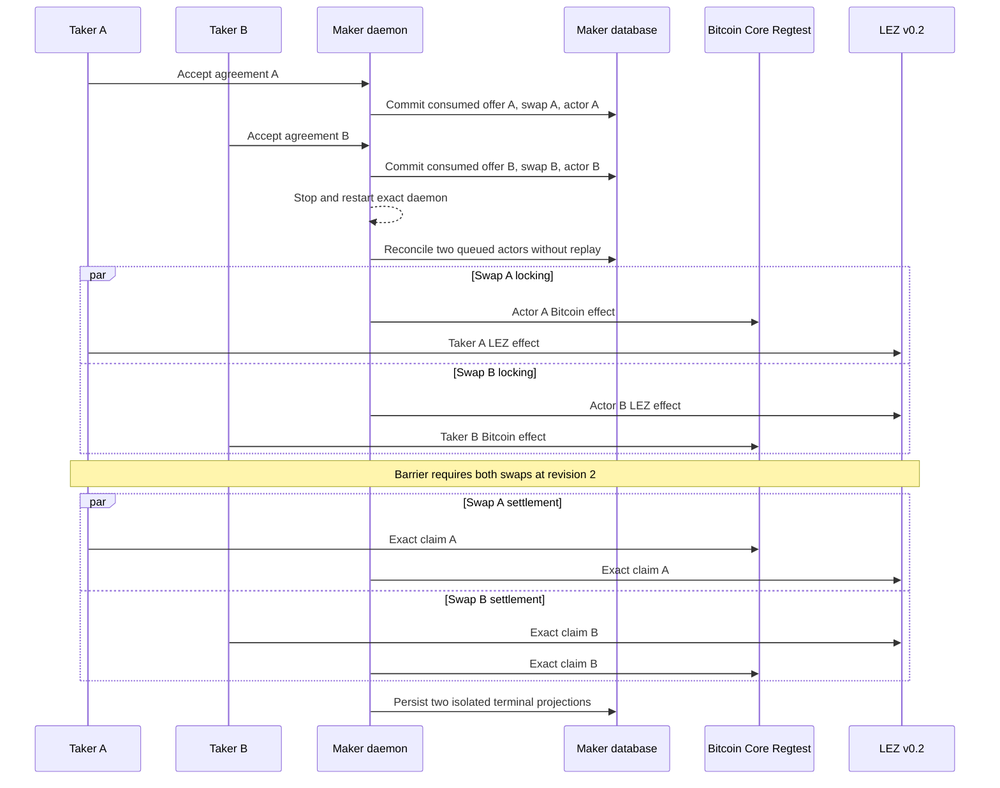

# ADR 0190: Compose accepted BTC overlap under one daemon

Status: accepted and checked exact-node GREEN for bounded opposite-direction
BTC concurrency; arbitrary-N, same-direction and adverse process schedules
remain

## Context

M3 already proves two opposite-direction BTC swaps overlapping on one isolated
Bitcoin Core Regtest node and one isolated LEZ v0.2 stack. It keeps agreements,
escrows, deadlines, actor stores, signing journals, and funding outpoints
distinct, then withholds settlement until both swaps are durably locked.

M5 separately proves real Delivery and Chat admission into daemon-provisioned
role actors. Its existing BTC runner intentionally admits one application
through one daemon and database. M7 U2 and submission row S5 still require the
composition: two accepted applications, one long-running Maker boundary, and
overlapping actual-chain effects with restart isolation.

The production daemon already accepts a bounded registry of as many as 256
startup-pinned BTC Maker authority templates and selects the exact template by
the authenticated swap ID. The missing capability is therefore runner
composition, not another scheduler or authority registry.

## Decision

Add an opt-in `M7_BTC_ACCEPTED_CONCURRENCY=1` mode over the current M3/M5
runner. It is fixed to native BTC, the claim journey, and the existing
opposite-direction overlap schedule. The mode must:

1. create two authenticated application plans with distinct swap identities;
2. load both exact Maker authority templates into one daemon;
3. accept both applications into one database and one Delivery/Chat boundary;
4. restart that daemon once before activation and prove no acceptance or actor
   registration replay;
5. run two bounded supervisor workers; and
6. retain the existing revision-two barrier so neither settlement begins until
   both independent swaps have actual locks.

The default M3 overlap and single-application M5 BTC paths remain unchanged.
The new contract is continuously checked. A clean pushed exact-node certificate
closes the concurrency slice, but does not make all of U2 or S5 GREEN because
their process-crash and remaining all-pair lifecycle criteria are separate.

The stage-one provisioner now accepts one explicitly pinned owner-private Maker
signing key. It reads that key through the existing stable O_NOFOLLOW,
single-link, mode-0600 boundary, writes a distinct-inode output copy, and
generates every Taker, refund, claim, and adaptor secret freshly while rejecting
collisions. Tests check both the library and literal CLI paths and ensure the
secret or its hexadecimal form never enters stdout.

The Delivery planner now retains its one-direction M5 default while the M7
mode configures both fixed direction routes through one daemon and database.
It requires the same public Maker identity, then produces two distinct signed
offer commitments, reservation IDs, and authenticated swap IDs. This source
composition and its legacy regressions are GREEN; the claims remain pending an
exact-node execution certificate.

The first exact-node composition attempt reached both local chains and the
forward authenticated plan before exposing a stale Taker-side restriction to
`taker-sells-foreign`. Planning now selects either value from the existing
bounded direction enum and authenticates the offer under that exact route; it
still rejects non-Bitcoin pairs and all Chat, signing, agreement, actor, and
receipt authority. A separate-process reverse-route test reproduces the
original failure without chain setup and proves the corrected Delivery path.

The next pushed exact-node replay reached both authenticated plans and then
exposed the same stale restriction at Chat acceptance. Acceptance now carries
the selected typed direction through offer discovery, unsigned-draft binding,
persisted retry, countersigning, and actor provisioning. A valid reverse
process fixture derives the LEZ depositor/claimant, Bitcoin claimant/refund
key, prepared-claim authority, and later timeout from the direction. This
closes the product capability but not the M7 composition: the next gate must
admit both already planned swaps through one restarted daemon and database.

The composed runner now uses a finalized-authority barrier between stage two
and activation. Both direction controllers publish their exact source-config
hashes; one coordinator starts a single Chat boundary over the already shared
planning database and Delivery directory with both swap-keyed Maker templates.
It accepts both applications without replay, stops and restarts that boundary,
requires exactly two durable BTC actor rows, and atomically publishes the two
role-config pairs. Both controllers remain blocked until this manifest exists,
so neither actor can create a chain effect from a singly admitted batch. This
source path is exact-node GREEN in `m7btcconc-b302925-a`: both agreements were
accepted, the daemon restarted, exactly two durable BTC actor rows remained,
and the atomic manifest released both controllers without replay. The forward
swap reached revision two with settlement withheld. The reverse swap projected
its LEZ first lock but then exposed the positive-prefix finality defect resolved
by ADR 0191. Exact run `m7btcconc-abd1403-a` then proved the reverse Bitcoin
second lock on attempt one and held both swaps at revision two before exposing
a stale legacy path in the isolation-evidence aggregator. The aggregator now
resolves exact application authority from the shared handoff manifest; terminal
two-direction overlap remains pending replay. Exact run
`m7btcconc-ad77632-a` proved that manifest-bound four-actor isolation packet,
then finalized the forward revealing claim before a second legacy-only guard
looked for the single M5 application root during terminal replay. Terminal
replay now resolves the exact direction/swap acceptance, agreement, receipt,
database row, and role config from the same shared authority boundary.
Exact run `m7btcconc-02ebd4a-a` then completed both direction settlements,
both role projections, and zero-resubmission terminal replay. The final packet
builder exposed one remaining inherited M5 cardinality branch: it retained only
the forward timing summary even though M7 had two immutable timing packets.
Final evidence now distinguishes legacy single-application M5 from explicit
two-application M7 in timing, stage-two, direction, effect, and application
metadata. Exact pushed run `m7btcconc-272788c-a` then published the complete
two-direction packet, completed both claims and all four zero-resubmission
terminal replays, and passed exact cleanup without targeting foreign resources.
ADR 0192 pins the compact certificate in CI.

## Components

## Acceptance and overlap flow

## Atomicity argument

The two swaps are not one transaction and are not atomic with each other. Each
swap remains conditionally atomic because its own adaptor secret is unusable
for settlement until both of that swap's locks are confirmed, and either the
claim path completes both legs or the independently signed timeout branches
recover them. The overlap barrier strengthens the test: no settlement secret
is released while either agreement is only singly funded. Distinct swap IDs,
agreements, outpoints, LEZ accounts, deadlines, state databases, and signing
journals prevent one swap's progress or restart reconciliation from
authorizing the other.

## Consequences

- The implementation reuses the audited daemon registry, supervisor, Chat
  acceptance, and M3 overlap controller.
- The test contacts no public RPC, peer, faucet, or public funds; its endpoints
  are run-owned literal-loopback services and its funds are deterministic
  local Regtest/genesis outputs.
- Loopback proves the real pinned node binaries and consensus/effect paths in
  an isolated topology. It does not prove public-provider reliability,
  production key custody, fee-market behavior, or future-reorg immunity.
