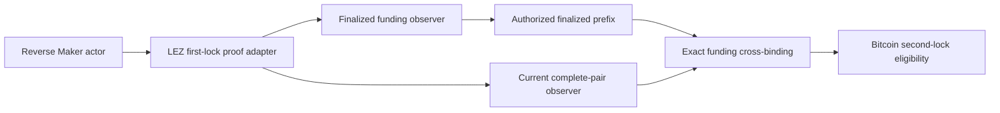
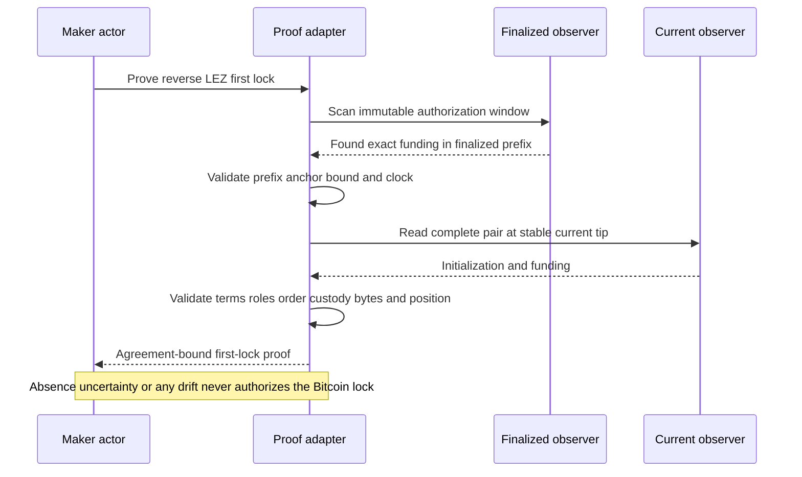

# ADR 0191: Accept positive first-lock finalized prefixes

Status: accepted; focused adapter regressions and strict package Clippy GREEN,
fresh exact-node replay pending

## Context

Exact run `m7btcconc-b302925-a` proved the shared M7 application seam: both
direction-bound agreements were accepted through one daemon and database, the
daemon restarted, exactly two durable BTC actor rows remained, and the atomic
handoff manifest released both controllers. The forward swap reached revision
two while settlement remained withheld. The reverse swap projected its LEZ
first lock for both roles, but the Maker then exhausted 120 second-lock
eligibility retries without emitting a Bitcoin effect.

The observer had already found the exact finalized LEZ funding transaction.
The adapter nevertheless required the entire immutable authorization window,
up to 4,096 blocks, to be finalized. That requirement is appropriate when
proving absence, but it is unnecessary for a positive proof and turns an
already finalized match into a long local-devnet delay.

## Decision

For a `Found` response, accept a nonempty finalized scan prefix only when it:

1. echoes the exact caller-owned context;
2. begins at the immutable authorization window's first height;
3. does not exceed that window;
4. ends exactly at the reported finalized height; and
5. contains the agreement-bound funding transaction at a valid finalized
   position.

`Absent` and `Uncertain` remain non-authorizing. A shifted or oversized prefix,
zero timestamp, position outside the authorization window, chain-identity or
instruction drift, and any current/finalized substitution all fail closed.
After the finalized positive match, the adapter still performs its separate
stable-current-tip read, validates the complete initialization/funding pair,
and cross-binds the exact funding identity, bytes, and position.

## Components

## Proof flow

## Atomicity argument

This change does not authorize action from absence or a partial transaction.
The positive finalized prefix already contains the exact signed-agreement
funding fact; waiting for unrelated future heights cannot strengthen that
fact. The independent current read protects against stale or substituted
state, and exact byte/position cross-binding ensures both views refer to the
same lock. Consequently the Maker's Bitcoin second lock remains conditional on
a finalized, currently valid LEZ first lock, while test and production latency
no longer scale with unused authorization-window capacity.

## Consequences

- Focused tests prove a strict positive prefix succeeds and a shifted prefix
  fails closed; the full first-lock target is GREEN 9/9.
- Strict all-target package Clippy is warning-free.
- The next exact M7 replay must prove that the reverse Bitcoin effect now
  occurs and that the existing two-swap settlement barrier remains intact.
- This does not claim public-provider reliability or future-reorganization
  immunity; the exact run continues to use isolated literal-loopback nodes.
