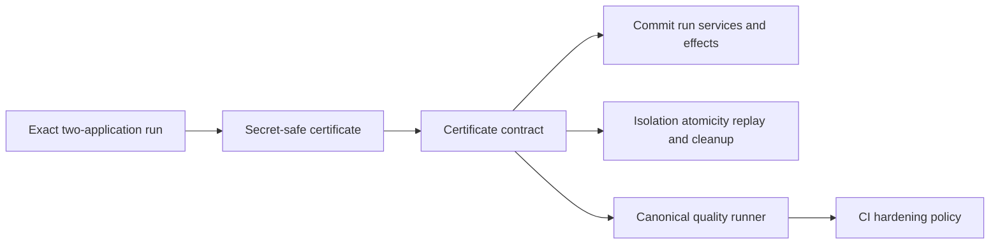
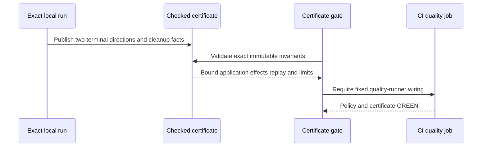

# ADR 0192: Pin accepted BTC concurrency evidence in CI

Status: accepted; exact-node certificate, quality gate, and CI-hardening policy
GREEN

## Context

ADR 0190 composes two opposite-direction accepted BTC applications under one
daemon/database and ADR 0191 removes the artificial positive-proof window wait.
Exact pushed run `m7btcconc-272788c-a` completed the whole bounded journey on
isolated Bitcoin Core 31.1 Regtest and LEZ v0.2 nodes. Without a checked packet
contract, later changes could silently drop one direction, one timing/effect
binding, the revision-two barrier, replay counts, or cleanup scope.

## Decision

Retain a compact secret-safe certificate and validate it on every quality run.
The contract pins exact source/run identity, shared application admission and
restart, both direction effect sets and timing hashes, independent actor and
escrow identities, the pre-settlement revision-two barrier, four terminal
zero-resubmission replays, local service versions, external-resource caveats,
conditional atomicity scope, and exact cleanup. CI hardening must require that
contract from the canonical quality runner.

## Components

## Evidence flow

## Atomicity and scope

The certificate proves two independent conditional successful-claim paths. It
does not make the two swaps atomic with each other. Each Maker second lock is
authorized only after its Taker first lock, and no revealing claim begins until
both agreements are revision two. Distinct agreements, outpoints, role stores,
signing journals, sessions, escrows and deadlines prevent cross-swap authority;
zero-effect terminal replay demonstrates idempotency. Arbitrary-N,
same-direction, process-kill, public-network, fee-stress and future-reorg cases
remain explicitly unclaimed.

## Consequences

- Bounded opposite-direction accepted BTC concurrency closes R5.
- U2 remains open for actual-chain process-crash recovery.
- S5 remains open for the other daemon-owned reference journeys and hardening.
- Runtime certification uses no public RPC, peer, faucet, funds or deployment.
  Pinned Bedrock NTP attempts are measured but non-gating.
