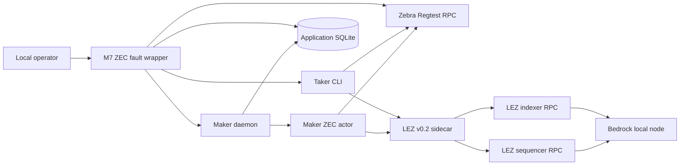
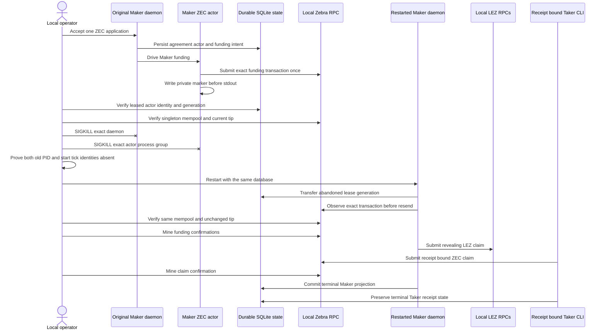

# ADR 0193: Recover accepted ZEC after an ordered process kill

Status: accepted; local-devnet PoC and CI contract GREEN, pushed-source
certificate pending

## Context

Accepted ZEC applications already persist an immutable actor registration,
role configuration, funding intent, and one-attempt submission identity before
the Maker supervisor starts the chain effect. The missing M7 U2 evidence was a
real process failure after Zebra accepted that funding transaction but before
the actor returned stdout to its daemon. Restart must reconcile the same
durable database and chain effect without treating missing stdout as permission
to send again.

The fault must be precisely reproducible without exposing a crash switch in a
production binary. It must also retain the normal user path: Maker daemon and
CLI admission, separate Taker CLI acceptance, daemon-owned Maker effects,
receipt-bound Taker effects, and real local LEZ v0.2 and Zebra Regtest nodes.

## Decision

Add a compile-time `test-crash-hooks` seam to the ZEC actor and daemon. The
actor writes one owner-private no-clobber marker only after `zcash_fund`
returns `submitted` and before stdout, then parks. The opt-in M7 runner binds
that marker to the exact leased swap, actor program digest, PID, Linux start
tick, generation, durable expected transaction ID, singleton Zebra mempool,
and unchanged chain tip.

The runner sends `SIGKILL` to the exact daemon and then the actor process group,
proves both old PID/start-tick identities absent without relying on a transient
`/proc/PID/exe` link, removes only their stale run-owned sockets, and starts a
new daemon over the same SQLite database. Recovery must advance
the abandoned lease generation, retain the identical unmined transaction and
tip, and observe before any possible resend. Only then may the ordinary runner
mine confirmations and continue both legs to terminal completion.

Feature builds use a unique owner-private Cargo target by default. An explicit
canonical mode-0700 cache may be reused across retries. Default release builds
retain their existing 20-second actor timeout and expose neither the hidden
pause arguments nor the marker hook. The feature-only run uses 120 seconds so
host contention cannot replace the parked generation before the external test
coordinator validates it.

The coordinator's read-only status observation may overlap the daemon-owned
actor's short private-material lease. That is a transient observation race,
not authority to repeat an effect. A bounded retry is allowed only when the
exact daemon identity remains live and the actor returns exit status 2, empty
stdout, and one of two exact byte-length-checked messages: configuration not
yet published or status material temporarily unavailable. Every other status
failure remains fatal, and each accepted retry class is written to evidence.

## Components and RPCs

All runtime RPCs bind dynamic literal-loopback ports. Bedrock, the sequencer,
and the indexer share one run-owned private Docker network; Zebra is a separate
run-owned peerless Regtest service. The wrapper never uses a public RPC,
faucet, public funds, or public deployment.

## Accepted-submission recovery sequence

## Atomicity argument

This remains a conditionally atomic swap protocol, not one distributed
cross-chain database transaction. Before the crash, the Maker has locked ZEC
but the claim secret has not been revealed on LEZ. Killing both owning
processes cannot grant either role a new branch or signing authority: the
agreement, funding intent, expected transaction ID, actor program, and lease
are durable and immutable. The restarted daemon must observe the exact
singleton transaction before progressing, so missing stdout cannot authorize a
second funding send.

After recovery, two confirmed Zcash funding blocks precede the revealing LEZ
claim. The Taker's receipt-bound Zcash claim is unavailable until that LEZ
effect reveals the committed preimage. Therefore a successful path gives the
Taker LEZ-side value only after the Maker funding is confirmed, and gives the
Taker the funded ZEC only through the revealed secret. Existing timelocks and
refund branches remain the escape path if settlement does not continue. This
PoC proves the successful claim branch and accepted-submission recovery; it
does not claim reorganization immunity, public-network reliability, fee stress,
or every adverse refund race.

## Consequences

- Actual local PoC `m7zecpk999e287d` transferred generation 24 to 26 while the
  same singleton funding transaction and Zebra tip 104 survived; terminal
  generation 37 completed both roles at tip 107.
- The PoC is not the final certificate because it used uncommitted source. A
  clean replay from the pushed implementation commit remains mandatory.
- Warm owner-private cache measurements reduced the unchanged sidecar build
  from 17 minutes 34 seconds to 3.29 seconds on the successful run.
- The first pushed-source replay exposed and safely stopped on the supervised
  status/material-lease overlap before any swap-chain effect. A contract-first
  regression now permits only that exact transient and the already recognized
  configuration-publication transient; Zebra remained at tip 104 with an empty
  mempool after the failed replay.
- Runtime external resources are empty. Cold dependency acquisition can depend
  on registries, while pinned Bedrock can attempt non-gating NTP; local CPU,
  disk, Docker readiness, finality, process scheduling, fsync, and RPC polling
  remain bounded flakiness sources.
- U2 remains open until the pushed-source certificate is checked into CI. S5
  remains open for other daemon-owned all-pair journeys and hardening.
