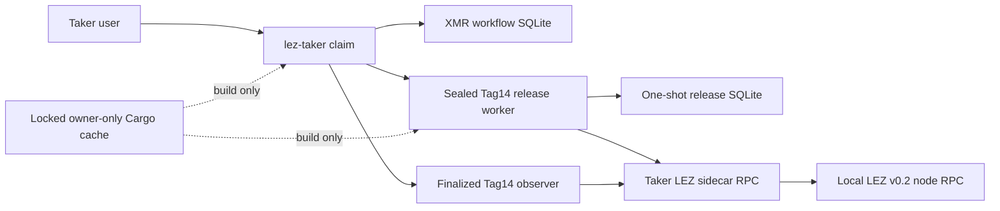
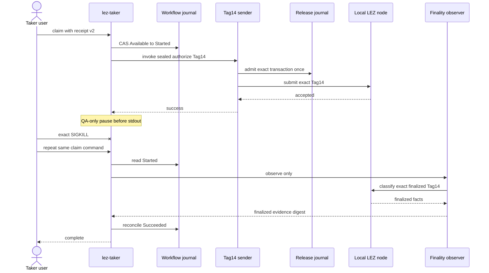
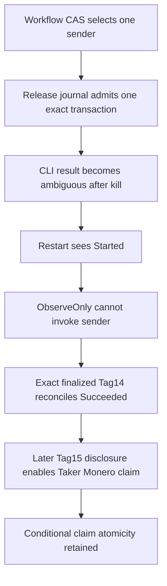

# ADR 0194: Recover Taker Tag14 after a process kill

Status: Accepted and certified on exact pushed commit `507a38b` with local
LEZ v0.2 and Monero 0.18.5.1 Regtest.

## Context

The receipt-v2 Taker claim already sends Tag14 once and reconciles it from
finalized LEZ evidence. The remaining claim-side unknown-outcome seam is the
interval after the sealed sender succeeds but before `lez-taker claim` returns
its result. A process loss there must not turn an ambiguous response into a
second submission.

## Decision

Add a compile-time-only `test-crash-hooks` pause after the sealed Tag14 child
exits successfully and before CLI stdout. The hook accepts only the exact
`authorize_lez_tag14` step, publishes one owner-private create-new marker, and
parks the Taker process. Normal binaries contain a no-op at this boundary.

The actual-node runner kills the exact Taker process group, reuses the same
receipt and workflow journal, and requires the next user command to reconcile
through the existing observation route. The authenticated one-shot release
journal must retain the same filesystem identity and SHA-256 through restart.

For repeat QA builds, an optional canonical mode-0700 owner-only cache holds
only Cargo target directories. One nonblocking lock excludes concurrent users;
the cache is never entered into the run resource ledger or cleanup. Cargo
revalidates source fingerprints, every staged executable is copied create-new
and rehashed at use, and the guest artifact remains independently rebuilt and
tested into run-owned evidence.

The semantic-claim QA mode also reduces only the actor supervisor's
reobservation delay from the production default of 3,600 seconds to one
second. The actor state transition, typed projection, durable database, and
restart sequence are unchanged; emitted evidence records both values and that
test acceleration was used. Ordinary M5 and production-default runs retain
3,600 seconds.

This is conditional cross-chain atomicity, not one distributed transaction.
Tag14 releases only the precommitted claim authority after both funding
preconditions; finalized Tag15 later exposes the material required for the
Taker Monero sweep. The crash changes neither branch authority nor chain
ordering because `Started` can only observe, never invoke again.

## Consequences

- Default and production binaries cannot enable the pause.
- The marker contains only step, state, and process identity and is deleted
  with the exact run's private state.
- Runtime evidence uses isolated loopback LEZ and Monero services and
  deterministic local funds; no public RPC, faucet, peer, or public deployment
  is needed.
- The cache can change build latency only. It owns no receipt, workflow,
  credential, node state, transaction, or retained certificate evidence.
- The one-second supervisor reobservation delay is confined to the explicit
  semantic-claim QA mode and is disclosed in run evidence.
- Exact local-node replay and its secret-safe CI certificate close this
  specific R4 claim-side ambiguous-result restart seam. Other R4 matrix rows
  remain tracked separately.
