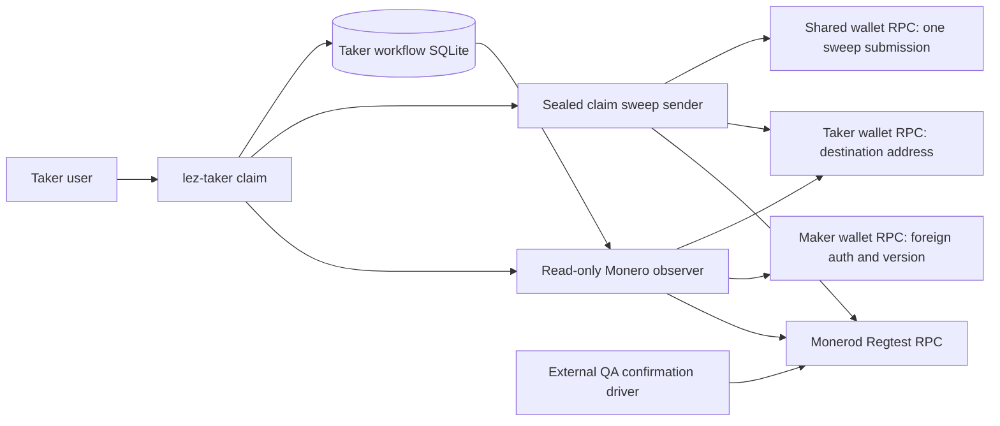
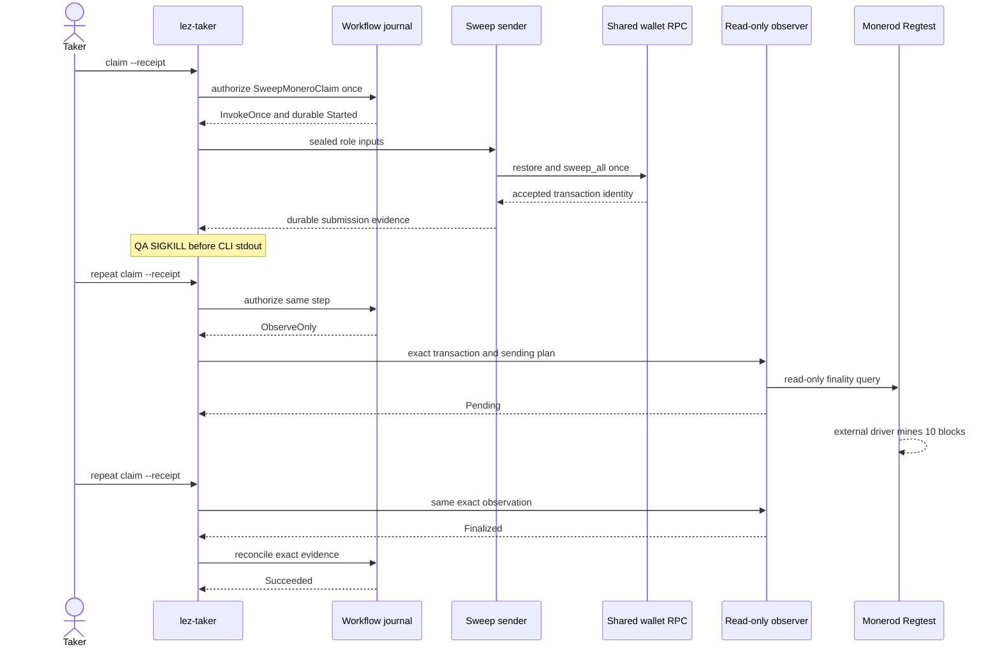

# ADR 0195: Recover a Taker Monero claim sweep after a process kill

Status: Accepted and exact pushed-source local-devnet GREEN. Exact run
`m7claimsweep997bd6bb` at `997bd6b` proved the one-shot submission,
post-acceptance Taker SIGKILL, observation-only restart, unchanged evidence,
ten-confirmation finality, semantic cross-chain binding, and exact cleanup.

## Context

The receipt-v2 Taker path durably recovers an ambiguous Tag14 publication, but
the subsequent Monero sweep still runs through the historical all-in-one local
tool. That tool submits, mines, and observes in one process. A process loss
after wallet acceptance can therefore leave the user unable to distinguish a
successful submission from a safe retry.

The maintained wallet adapter already exposes `restore_shared_and_sweep_once`,
and the XMR workflow journal already permits one `Prepared` to `Started`
invocation followed only by observation. The Maker refund route proves this
shape. The claim route should reuse it with role- and session-specific inputs.

## Decision

- Advance `SweepMoneroClaim` only after finalized Tag15 and the validated
  Taker claim transcript expose the precommitted Maker adaptor scalar.
- Reuse the sealed no-argument Monero sender and read-only observer boundary,
  parameterized by the durable role and workflow step. Claim receives the
  Taker share and finalized claim signature; refund retains its existing Maker
  inputs.
- Let the real `lez-taker claim --receipt` command select the prepared claim
  sweep after Tag14 is complete. It consumes the sole invocation authority or,
  after an ambiguous result, selects only the observer.
- Keep confirmation mining outside both sender and observer. The QA runner
  kills the exact Taker process after the sender succeeds but before CLI
  stdout, restarts the same command, requires observe-only state and unchanged
  submission identity, then mines ten deterministic Regtest blocks.
- The crash hook remains compile-time gated and absent from production
  binaries.

## Components and RPCs

All RPC origins are fresh dynamic literal-loopback endpoints. No public peer,
RPC, faucet, public funds, DNS, or public deployment participates. The observer
reuses the established topology verifier to require official Regtest identity,
zero peers, pinned daemon/wallet versions, distinct RPC origins, and rejection
of Maker credentials at the Taker wallet before it can publish finality.

## Crash and recovery sequence

## Atomicity argument and limits

Before finalized Tag15, the Taker lacks the Maker adaptor scalar and cannot
reconstruct the shared Monero spend key. After Tag15, the Taker can sweep the
already funded output. Persisting `Started` before the one wallet call prevents
an ambiguous process result from rearming that authority; restart can only
observe the precommitted transaction terms. Thus this seam preserves the
successful-claim conditional atomicity argument and removes a double-send
hazard. It is not a distributed cross-chain transaction, does not make a
future-reorganization claim, and does not by itself certify Tag15 submission
crash recovery.

## Consequences

- The all-in-one local sweep remains available only for historical PoC
  compatibility; the durable user path separates send, mine, and observe.
- Sender output is submission evidence, never finality evidence.
- The secret-safe exact-run certificate is enforced by the canonical quality,
  CI-hardening, and R4 baseline gates. It intentionally omits process and
  filesystem identities, exact transaction bytes, paths, credentials, and
  private material.
- R4 remains open only for the independent Tag15 accepted-before-stdout
  process-kill seam; this evidence does not claim to cover that sender.
