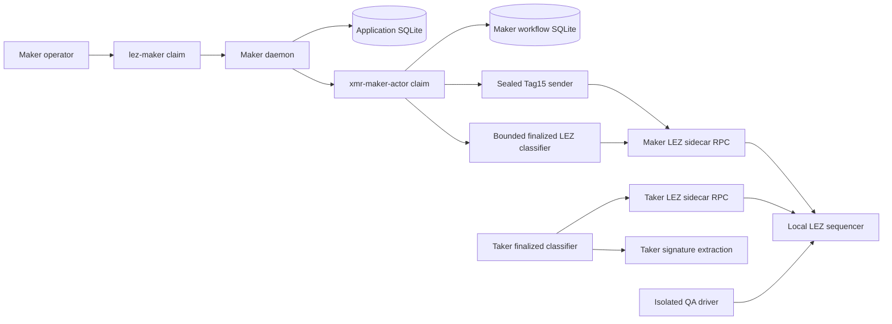
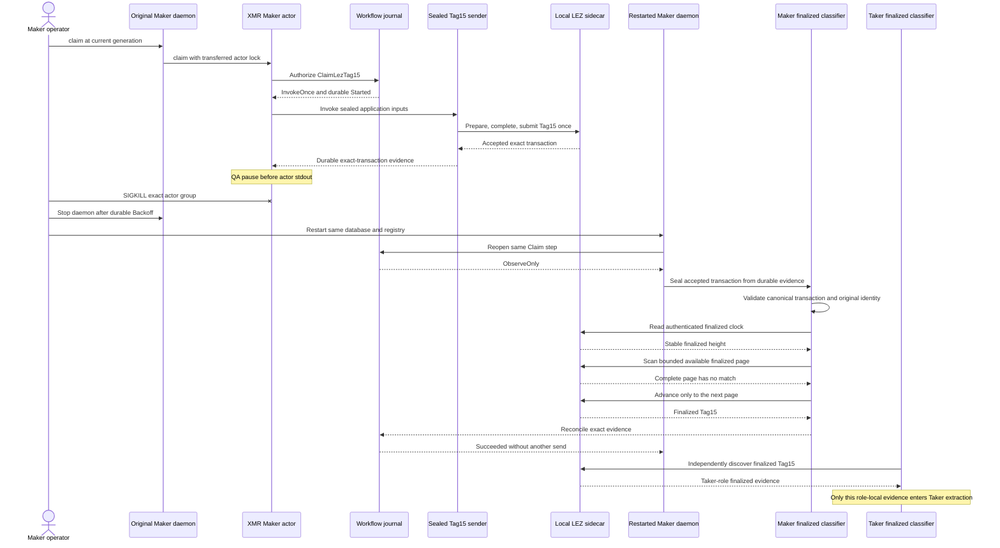

# ADR 0196: Recover Maker Tag15 after a process kill

Status: Accepted and actual-node GREEN on exact pushed-source run
`m7tag15kille455deca`; the sanitized certificate closes R4.

## Context

The claim corridor currently prepares and submits Tag15 through a standalone
local driver. The durable Maker workflow already defines the role-fixed
`ClaimLezTag15` invocation slot, the effect authority already pins the Tag15
sender and finalized classifier, and the daemon already maps the owner's Claim
action to an actor `claim` command. The missing composition means a process
loss after LEZ transport acceptance but before stdout is not yet recovered by
the normal Maker application path.

## Decision

- Add an evidence-driven Maker-claim activation that authenticates the exact
  Monero funding pair, finalized Tag14 authorization, and Maker final-signature
  packet before selecting Claim and preparing `ClaimLezTag15`.
- Run Tag15 as a sealed no-argument effect child. Exact Stage A/B, Maker
  runtime, capability, final signature, application identity, and tool plan
  remain on fixed sealed descriptors; no secret enters argv or environment.
- Add the real XMR Maker actor `claim` command. It consumes
  `InvokeOnce` or, after any ambiguous prior attempt, can only invoke the
  existing finalized LEZ observer with the unchanged sending-plan digest.
- Treat the adaptor journal as monotonic protocol state. Reload accepts the
  Stage-B Maker partial and its two legitimate advanced phases only after
  cryptographically reverifying both partials and reconstructing the exact
  durable presignature; earlier or inconsistent phases remain rejected.
- Keep finality production outside the sender and observer. The Tag14
  prerequisite and Tag15 recovery observers first read the authenticated
  finalized clock, scan consecutive pages of up to 16 already-finalized
  blocks, advance only after typed finalized coverage of the complete prior
  page, and cap one invocation at the protocol's 4,096-block discovery bound.
  Both owner-side recovery observers retain their exact persisted transaction
  target. The independent Taker-side Tag15 classifier continues terms-based
  discovery for signature extraction. None has submission authority. The isolated QA
  runner kills the exact actor group only after durable Tag15 submission and
  before actor stdout, cleanly restarts the daemon over the same database and
  workflow, and requires finalized observation with zero second send.
- Keep the pause hook compile-time gated and absent from production binaries.

## Components and RPCs

The actual replay also runs local LEZ Bedrock/indexer and official Monero
Regtest daemon plus authenticated role wallets for the preceding cross-chain
funding and Tag14 prerequisites. Every runtime origin is a fresh dynamic
literal-loopback endpoint with deterministic local funds and no public peer,
RPC, faucet, funds, or deployment.

## Crash and recovery sequence

## Atomicity argument and limits

The Maker may publish Tag15 only after exact Monero funding and finalized
Taker Tag14 expose the precommitted claim authorization. Tag15 transfers LEZ
custody to the Maker while revealing the final signature from which the Taker
can derive the complementary adaptor scalar and sweep the already funded
Monero output. Persisting `Started` before the one Tag15 transport call means
an ambiguous process result cannot rearm publication authority; restart has
  only the spend-authority-free finalized classifier. The unchanged effect-plan
  identity and canonical owner-private submission evidence bind observation to
  the original application, terms, transaction ID, and exact accepted bytes.
  Both owner recovery classifiers use the persisted exact transaction target;
  the separate Taker classifier uses terms discovery because it did not submit
  the Maker transaction. Every request uses the Taker or Maker role-local read-only
capability; page movement therefore changes liveness, not who can spend or
submit. This preserves the successful-claim conditional atomicity argument and removes the
double-send hazard, but it is not a distributed transaction and does not claim
future-reorganization immunity. Maker reconciliation evidence and Taker
signature-extraction evidence are deliberately separate role-local reads of
the same finalized transaction; neither role inherits the other's sidecar
trust context.

## Consequences

- The real Maker Claim action becomes the canonical application path for
  Tag15; the standalone driver remains only as a compatibility/debug surface.
- Submission evidence is durable before the fault marker and is never treated
  as finality evidence.
- The first exact replay exposed and fixed a pre-Tag15 validator that rejected
  the legitimate post-Tag14 Maker signing phase; that failed run completed
  exact cleanup but is not certification evidence.
- The second exact replay at pushed commit `160f129` exposed a finalized
  observation boundary: Tag14 landed at height 131, exactly beyond the fixed
  115--130 page. The observer stayed `ObserveOnly` and never re-sent, while
  the chain advanced to height 200. Interrupt cleanup passed with source status
  130, every exact resource absent, and the foreign sentinel intact. Bounded
  finalized pagination on both observers fixes the liveness defect without
  adding send authority; the interrupted run is not certification evidence.
- The third exact replay at pushed commit `34642a4` passed Tag14 finality and
  reached the intended accepted-before-stdout Tag15 kill boundary. The restart
  remained observation-only with zero second send, but 35 durable lease
  generations did not terminalize before the six-minute QA ceiling because a
  partial next page could not be queried until all 16 blocks finalized. Source
  status was 1; exact cleanup passed, every run resource was absent, the
  foreign sentinel survived, and no broad cleanup occurred. This
  non-certificate run drove finalized-clock-bounded 1--16 block tail pages.
- The fourth exact replay at pushed commit `530164e` passed both local nodes,
  deployment, role onboarding, funding, Tag14, and the accepted-before-stdout
  Tag15 kill. It exposed two QA defects after the one send: Maker-side terms
  discovery was rejected because the submitting role must observe its exact
  transaction, and the harness could miss a queued state after an immediate
  later-generation lease. Exact cleanup passed. The correction validates the
  canonical owner-private submission evidence, seals only its exact transaction
  on FD 225 for the read-only Maker observer, and accepts either the original
  queued generation or a later live lease as durable handoff. The independent
  Taker discovery path is unchanged.
- Exact pushed-source run `m7tag15kille455deca` at `e455dec` passed all prior
  phases, killed the Maker actor after one durable Tag15 acceptance, transferred
  generation 4 through observation-only recovery to terminal generation 7,
  and retained the unchanged transaction identity with no retry. Tag15 finalized
  at LEZ block 137 under tip 143; the independent Taker path swept Monero with
  ten confirmations. Source exit 0 and exact cleanup passed with the foreign
  sentinel intact. The secret-safe checked certificate is
  `docs/evidence/m7-actual-maker-tag15-process-kill-e455dec-20260811.json`.
