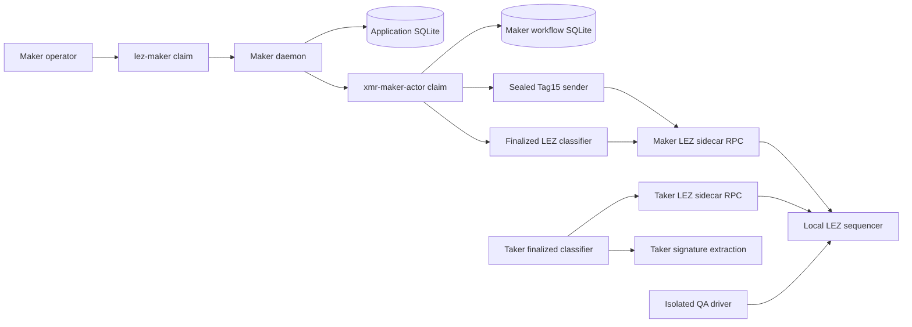
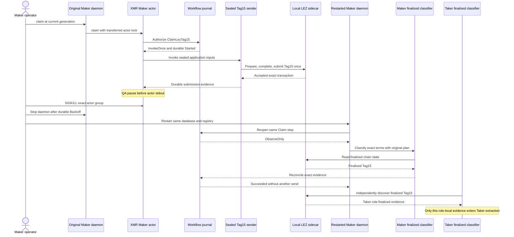

# ADR 0196: Recover Maker Tag15 after a process kill

Status: Accepted and focused implementation GREEN. The exact pushed-source
local-devnet replay and sanitized certificate remain required before R4 closes.

## Context

The claim corridor currently prepares and submits Tag15 through a standalone
local driver. The durable Maker workflow already defines the role-fixed
`ClaimLezTag15` invocation slot, the effect authority already pins the Tag15
sender and finalized classifier, and the daemon already maps the owner's Claim
action to an actor `claim` command. The missing composition means a process
loss after LEZ transport acceptance but before stdout is not yet recovered by
the normal Maker application path.

## Decision

- Add an evidence-driven Maker-claim activation that authenticates the exact
  Monero funding pair, finalized Tag14 authorization, and Maker final-signature
  packet before selecting Claim and preparing `ClaimLezTag15`.
- Run Tag15 as a sealed no-argument effect child. Exact Stage A/B, Maker
  runtime, capability, final signature, application identity, and tool plan
  remain on fixed sealed descriptors; no secret enters argv or environment.
- Add the real XMR Maker actor `claim` command. It consumes
  `InvokeOnce` or, after any ambiguous prior attempt, can only invoke the
  existing finalized LEZ observer with the unchanged sending-plan digest.
- Keep finality production outside the sender and observer. The isolated QA
  runner kills the exact actor group only after durable Tag15 submission and
  before actor stdout, cleanly restarts the daemon over the same database and
  workflow, and requires finalized observation with zero second send.
- Keep the pause hook compile-time gated and absent from production binaries.

## Components and RPCs

The actual replay also runs local LEZ Bedrock/indexer and official Monero
Regtest daemon plus authenticated role wallets for the preceding cross-chain
funding and Tag14 prerequisites. Every runtime origin is a fresh dynamic
literal-loopback endpoint with deterministic local funds and no public peer,
RPC, faucet, funds, or deployment.

## Crash and recovery sequence

## Atomicity argument and limits

The Maker may publish Tag15 only after exact Monero funding and finalized
Taker Tag14 expose the precommitted claim authorization. Tag15 transfers LEZ
custody to the Maker while revealing the final signature from which the Taker
can derive the complementary adaptor scalar and sweep the already funded
Monero output. Persisting `Started` before the one Tag15 transport call means
an ambiguous process result cannot rearm publication authority; restart has
only the spend-authority-free finalized classifier. The unchanged effect-plan
identity binds observation to the original application and terms. This
preserves the successful-claim conditional atomicity argument and removes the
double-send hazard, but it is not a distributed transaction and does not claim
future-reorganization immunity. Maker reconciliation evidence and Taker
signature-extraction evidence are deliberately separate role-local reads of
the same finalized transaction; neither role inherits the other's sidecar
trust context.

## Consequences

- The real Maker Claim action becomes the canonical application path for
  Tag15; the standalone driver remains only as a compatibility/debug surface.
- Submission evidence is durable before the fault marker and is never treated
  as finality evidence.
- R4 can close only after the focused process test and a clean pushed-source
  exact-node replay prove unchanged identity, zero second send, and exact
  cleanup.
