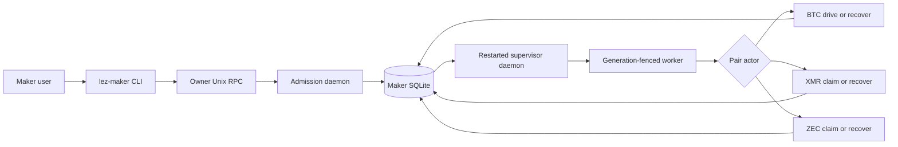
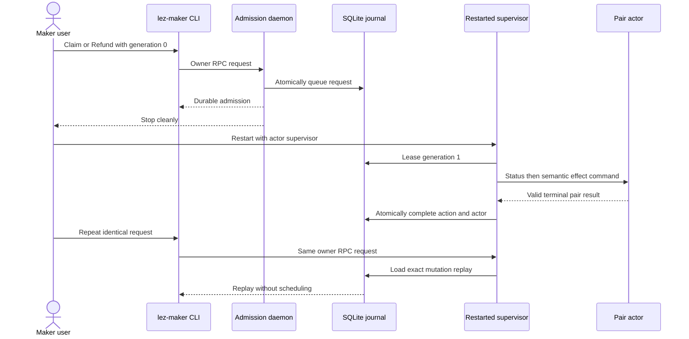

# ADR 0197: Compose Maker all-pair actions through the daemon

Status: Accepted and process-GREEN for the complete Maker Claim/Refund matrix.

## Context

The owner CLI already admitted generation-fenced Claim and Refund requests for
Bitcoin, Monero, and Zcash, and the supervisor already mapped each pair to its
semantic actor command. Those tests were separate. They did not prove that the
same durable request admitted through the real owner RPC survives a daemon
restart, reaches the role-correct subprocess, completes atomically, and exact
replays without a second effect for all six pair/action combinations.

This is a functional process boundary. Marker actors deliberately replace
chain nodes so this decision does not claim a new on-chain swap, finality,
reorg behavior, or production readiness. Actual local-node pair effects remain
certified by their pair-specific evidence.

## Decision

Run one table-driven black-box matrix over BTC, XMR, and ZEC crossed with Claim
and Refund. Each case uses the existing validated pair authority fixture and
production SQLite schema. The user queues the action with the real `lez-maker`
CLI against an owner daemon without workers. That daemon stops cleanly, a new
daemon opens the same database with the production supervisor enabled, and the
role actor must receive the pair-semantic command:

| Pair | Claim actor command | Refund actor command |
|---|---|---|
| BTC | `drive` | `recover` |
| XMR | `claim` | `recover` |
| ZEC | `claim` | `recover` |

The actor result and manual action resolve in the same immediate SQLite
transaction. The owner then repeats the identical CLI request and must receive
an exact replay without another actor invocation. A different post-terminal
request is rejected. Finally, the test stops the daemon and reopens SQLite to
verify terminal process state, completed action state, cleared child identity,
and the validated terminal progress projection.

## Atomicity argument

Admission writes one request identity and one open action under an immediate
transaction. A generation-fenced worker exclusively leases that action and
the per-swap kernel lock prevents another actor process from using the same
role state. Terminal resolution updates the actor schedule, validated progress,
and manual-action state in one immediate transaction. Therefore a visible
completed action cannot coexist with an uncommitted terminal actor projection,
and exact replay cannot create a second open action or subprocess invocation.
This is local application atomicity around chain-effect authority; it is not a
claim that two chains provide a distributed transaction.

## Consequences

- U3 is GREEN for the supported Maker CLI lifecycle matrix.
- F9, U4, and S5 remain open for the remaining Taker and adverse actual-node
  journeys.
- Runtime external resources are none: temporary Unix sockets, subprocesses,
  and SQLite files only. No Docker service, node, RPC, faucet, DNS, network,
  public deployment, or funds participate.
