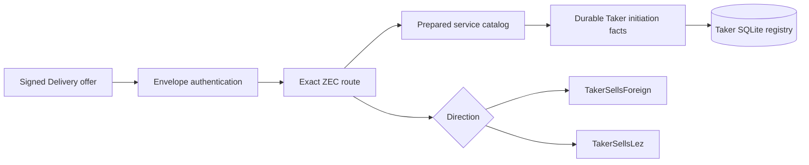
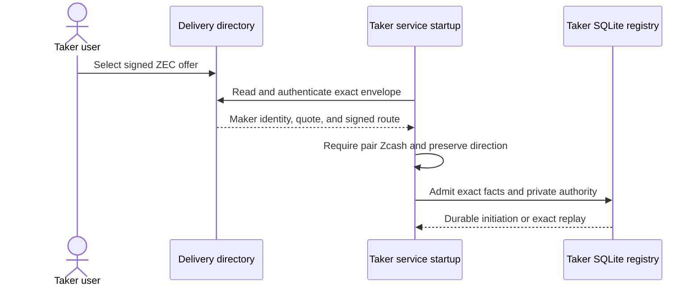

# ADR 0198: Derive the ZEC Taker direction from the authenticated offer

Status: Accepted and process-GREEN through both application directions.
Actual-node first-lock absent-Maker execution remains in progress.

## Context

The ZEC SDK and reference actor already model both `TakerSellsForeign` and
`TakerSellsLez`, but the application-facing Taker registry and prepared service
configuration silently fixed every ZEC initiation to `TakerSellsLez`. That
cannot reproduce the missing user journey where the Taker locks Zcash first
and an absent Maker never creates the LEZ second lock.

Adding an operator-supplied direction beside an authenticated Delivery offer
would create two authorities for the same fact. The direction must instead
remain part of the already signed route and flow unchanged into durable Taker
facts.

## Decision

Permit both typed ZEC directions in `TakerInitiationFactsV1`, while continuing
to reject every non-ZEC pair. During prepared-service startup, authenticate the
signed Delivery envelope first, take its exact route, require that its pair is
Zcash, and bind that same route into the durable initiation facts. No new
configuration field or schema version is introduced.

## Atomicity argument

This slice does not perform a chain effect. It removes a pre-effect ambiguity:
the route used by later role selection is the same route authenticated from
the signed offer and committed with the initiation in one SQLite transaction.
There is no separate mutable direction setting that could disagree with the
offer. Cross-chain atomicity still depends on the later signed cutoff, two
fresh Maker-lock absence observations, and a fresh canonical/unspent Taker
first-lock observation before the one-attempt refund. Those effect gates are
not claimed complete by this decision.

## Consequences

- Both ZEC directions round-trip through the registry and prepared startup
  catalog without changing the existing JSON schema.
- Existing `TakerSellsLez` configurations remain compatible.
- Acceptance, Maker Chat completion, actor execution, and the exact local-node
  absent-Maker certificate must carry the authenticated direction before U4,
  F9, or S5 can close. The process proof now closes the first three clauses;
  exact local-node execution remains.
- These tests use temporary files and SQLite only. No node, RPC, Docker
  service, faucet, public endpoint, deployment, or funds participate.

The checked process matrix uses the real `lez-taker` CLI and Maker Chat. In
`TakerSellsForeign`, the Taker source and accepted actor alone retain the
preimage and Zcash funding candidate, the Maker actor retains neither, and the
Maker SQLite transaction contains zero Maker claim-material rows. Completion
survives a deliberately lost response and exact replays without replacing role
authority. The original `TakerSellsLez` prepared-service initiation remains
GREEN with Maker-owned claim material. This is application process evidence,
not an on-chain first-lock/refund certificate.
