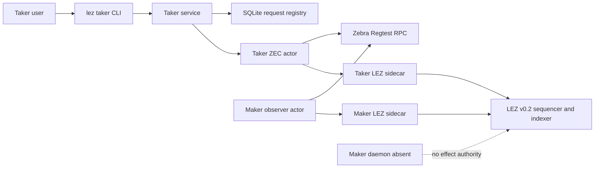
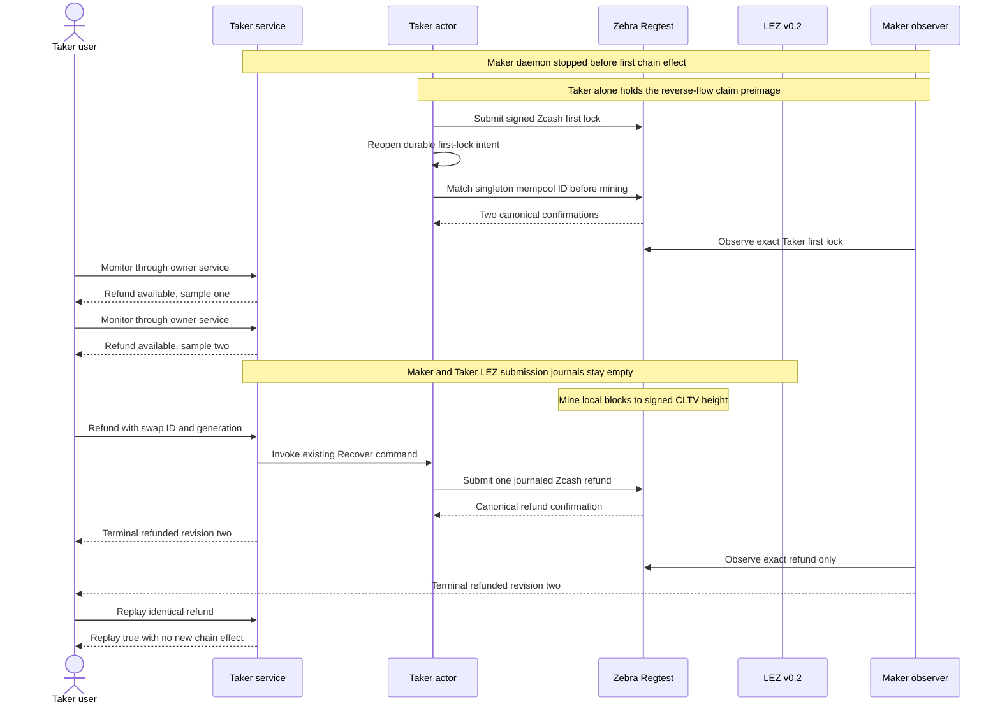

# ADR 0199: Recover the reverse ZEC first lock without Maker

Status: Accepted for exact local-node certification

## Context

In `TakerSellsForeign`, the Taker funds the transparent Zcash BIP-199 output
first and the Maker would fund LEZ second. The application route already
preserves this signed direction, but M7 still needs a reproducible user journey
where the Maker disappears before its LEZ lock and the Taker recovers the only
funded leg.

## Decision

Use the existing Chat acceptance, prepared Taker service, reference actors,
LEZ v0.2 sidecars, and Zebra Regtest adapter. Start the Taker service while the
negotiation transports exist, then stop the Maker daemon and remove Chat and
Delivery before any chain effect. The Taker funds Zcash, both actors project
that confirmed first lock, and the Taker records two fresh absent-Maker
observations. The local runner mines Zebra to the refund height already derived
from the signed agreement; it never shortens the protocol deadline. The real
generation-fenced `taker_swap_refund_v1` method invokes the existing actor
`recover` command. The Maker actor is used afterwards only to observe the
Taker-owned refund and reach the same terminal revision.

The Taker service owns the Taker actor lease for the whole application
journey. Consequently the adverse absence proof never invokes that actor
directly. It retains an independent read-only Maker observation of the
confirmed first lock, takes two stable `taker_swap_monitor_v1` samples from the
owner service, and brackets those samples with both role-local LEZ submission
journals empty. This is the same ownership boundary a real Taker user sees.
The generic direct-actor readiness precheck remains on the existing forward
second-lock Refund path, but this service-owned first-lock route admits Refund
from the service's already-validated `refund_available` state and exact
progress generation. It does not attempt a second owner through either
`status` or `drive`.
Both the forward second-lock Refund journey and this reverse first-lock Refund
journey enter the same service refund dispatcher. Claim remains a separate
branch; the journey label cannot silently fall through into it.

Before mining, a read-only role-aware inspector opens the Taker's durable
first-lock journal, validates the rebound Maker/Taker config pair, converts the
stored internal submission ID to the Zebra display transaction ID, and
requires the isolated singleton mempool entry to match it exactly. The
forward Maker-funded path uses the same inspector over Maker's second-lock
journal. Raw transaction bytes remain undisclosed.

Chat authority is also direction-aware. `TakerSellsForeign` leaves the claim
preimage only in the Taker actor inputs; the Maker daemon retains its own
recovery key and actor-provisioning authority but starts without a preimage.
Agreement completion requires that optional preimage exactly when the signed
agreement makes Maker the LEZ claimant. This prevents a reverse-flow shortcut
from copying Taker custody into the Maker process.

The Taker facade advertises capabilities per route rather than only per pair.
Its stable table therefore contains four entries: BTC reverse, XMR forward,
ZEC forward, and ZEC reverse. Offer browsing rejects routes outside that table
but admits either composed ZEC direction before consulting Delivery.

## Atomicity argument

This is conditional cross-chain atomicity, not one distributed transaction.
Before the signed cutoff, a Maker second lock could still make the claim path
possible. In this adverse journey the sole Maker effect authority is stopped,
both LEZ sidecar journals remain empty, and two fresh owner-service samples
keep the Taker at Refund Available with no Maker lock. At and after the signed
Zcash CLTV height, only the Zcash funder
can sign the refund. The Taker service durably selects Refund under the swap
lock before invoking the actor, the actor persists exact bytes before send,
and identical retries only reconcile that intent. The Maker observer has no
submission authority. Therefore the run can end only with the Taker's original
Zcash returned, or fail closed without a second-chain effect; it cannot create
a partial LEZ loss through this path.

## Consequences

- The default M5/M6 forward route is unchanged.
- Public deployment remains configuration plus the required on-chain
  deployment; this certificate uses only isolated local nodes.
- Exact-node evidence is required before F9, U4, or S5 may close.
- A reverse application must not supply the Taker-owned preimage to the Maker
  daemon merely to satisfy process startup.
- No external security review or security-completion claim is part of this ADR.
