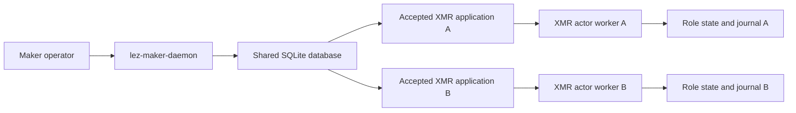
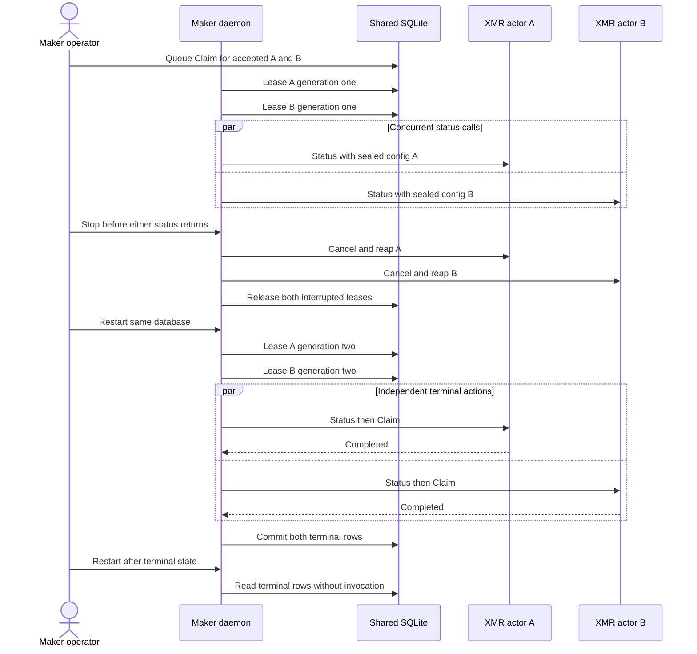

# ADR 0200: Overlap two XMR applications through one daemon

Status: Accepted and functional process-GREEN

## Context

M7 has exact local-node XMR claim, refund, losing-branch, process-recovery, and
accepted-application concurrency certificates. Before paying the cost of the
now-completed two-devnet run, the shared Maker
application boundary must prove that two XMR rows can hold independent leases,
survive one daemon interruption, and terminalize without sharing authority.

## Decision

Exercise two distinct XMR agreements as two already-authenticated coordinator
rows in one real `lez-maker-daemon` database. Give each row a separate actor
configuration, role journal/state database, program identity, swap ID, and
owner Claim request. Use two daemon workers and hold both real actor processes
inside their read-only Status calls until an observer proves both leases exist.

Stop the daemon before either actor returns. Require both old child identities
to disappear and both durable rows to lose their leases. Restart the same
database with an explicit one-second test-only retry backoff, prove two new
leases, release both actors, and let each execute the canonical XMR Claim
effect response. A third daemon start must preserve both terminal rows and must
not invoke either actor again. Production retry defaults are unchanged.

## Atomicity and evidence scope

Each lease, manual action, actor projection, and terminal schedule transition
is committed per swap in SQLite. Distinct manifests and state databases prevent
one worker from consuming the other swap's authority, while generation leases
prevent two workers from owning one row. Daemon cancellation reaps both child
identities before restart; the next generations retry their unchanged queued
actions. Terminal rows are absorbing, so the third start cannot invoke another
effect.

This is application/process atomicity only. Marker actors deliberately contact
no LEZ or Monero node and do not claim cross-chain completion, finality, fees,
or reorganization behavior. The corresponding actual-node evidence is checked
under ADRs 0204 and 0206. ADR 0203 assigns fee, reorganization,
and adverse continuation to their literal Reliability rows rather than F6.

## Consequences

- The existing one-daemon multi-pair scheduler now has an XMR-specific two-row
  overlap and restart regression.
- Runtime external resources are empty: temporary owner-only files, Unix RPC,
  SQLite, and local child processes only; no Docker, public RPC, faucet, peer,
  funds, or deployment participates.
- The focused command is
  `./scripts/test-m7-xmr-accepted-concurrency-contract.sh`.
- No external security review or security-completion claim is part of this ADR.
