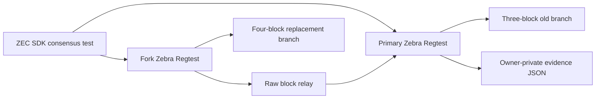
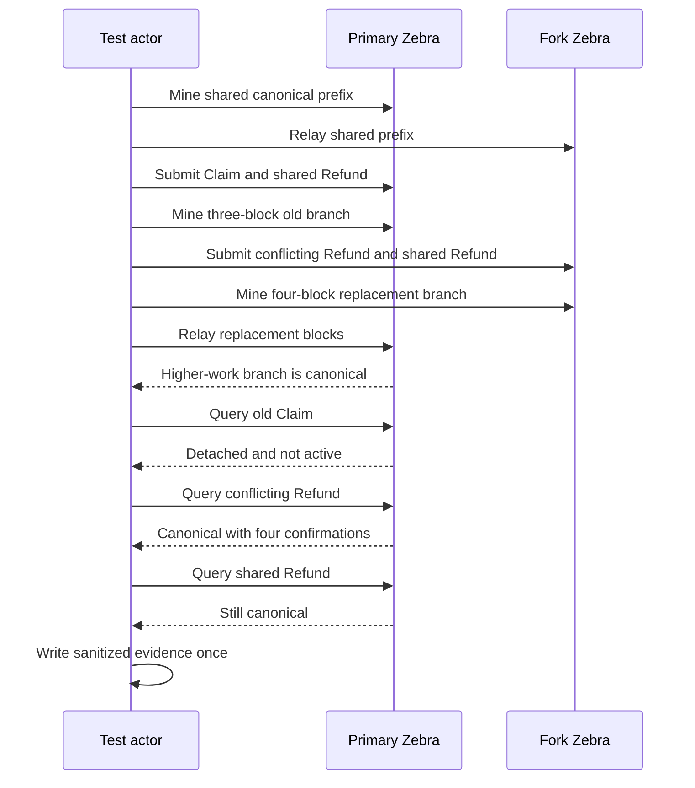

# ADR 0201: Retain Zebra competing-fork evidence

Status: Accepted for exact pushed-source local-node replay

## Context

The pinned Zebra Regtest suite already exercises two isolated nodes with an
identical prefix. One node confirms a Claim and an independent Refund on a
three-block branch. The other confirms a conflicting valid Refund plus the
same independent Refund on a four-block branch, after which the test relays
that higher-work branch back to the primary node. M7 R1/F6 need this consensus
behavior retained as reviewable evidence rather than only ephemeral test logs.

## Decision

Keep the existing transaction construction, branch generation, and raw-block
relay. Add one optional owner-private evidence output selected by
`M7_ZEBRA_REORG_EVIDENCE`. It is created once with mode `0600` and cannot
overwrite another run. The evidence records the common height, old and
replacement branch hashes/heights, the detached Claim, canonical conflicting
Refund, canonical shared Refund, and the exact outcome booleans.

After the longer branch becomes canonical, explicitly require the old Claim to
be unavailable or indexed with `in_active_chain = false`, the conflicting
Refund to be active with at least four confirmations, the unrelated Refund to
remain confirmed, and every detached height to match the fork node's
replacement branch. Raw
transactions, keys, endpoints, process identities, and filesystem locations
are excluded.

Exact pushed-source run `m7reorg087c37fa` is GREEN. The checked certificate at
`docs/evidence/m7-actual-zebra-competing-fork-087c37f-20260812.json` binds the
three-block detached branch, four-block canonical replacement, transaction
classification, restart prerequisite, and exact cleanup to commit `087c37f`.
The retained lookup shape was `indexed_detached`; Zebra explicitly reported
the old Claim outside the active chain.

## Atomicity and evidence scope

The test proves a concrete Zcash consensus outcome: two valid spends of one
HTLC output cannot both remain canonical, and the higher-work branch selects
the conflicting Refund while an unrelated Refund survives. This supports the
conditional atomicity argument by demonstrating that canonical-chain identity,
not prior inclusion, controls which spend is authoritative.

It is an SDK/consensus test, not yet the full Maker/Taker application recovery
after reorg. It does not prove LEZ rollback, daemon rescheduling, fee pressure,
or public-network behavior. The exact pushed-source replay is certified, but
R1/F6 remain open until application-level continuation is completed.

## Consequences

- Default test behavior is unchanged when the evidence variable is absent.
- Runtime uses only two isolated Zebra 5.2.0 Regtest containers, deterministic
  local outputs, raw-block RPC relay, zero public peers/resources, and no faucet
  or public funds.
- Cold image/dependency acquisition can use pinned external registries; runtime
  flakiness is limited to local Docker, ports, CPU, disk, and process scheduling.
- Exact-run cleanup remains owned by `scripts/run-zebra-e2e.sh`; no broad prune
  or foreign Docker selector is introduced.
- No external security review or security-completion claim is part of this ADR.
